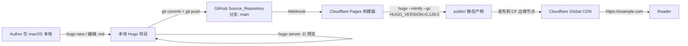
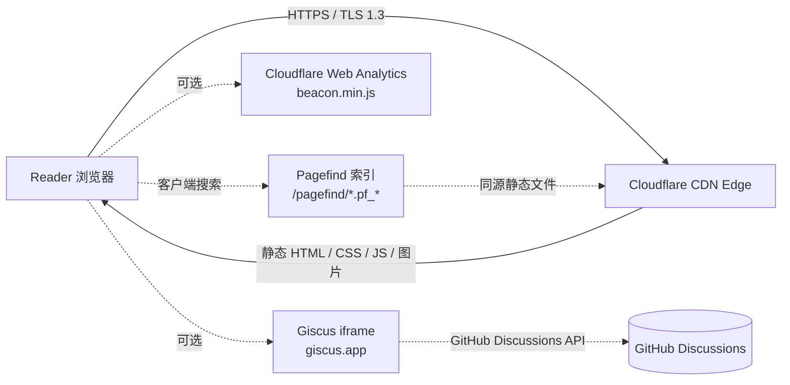
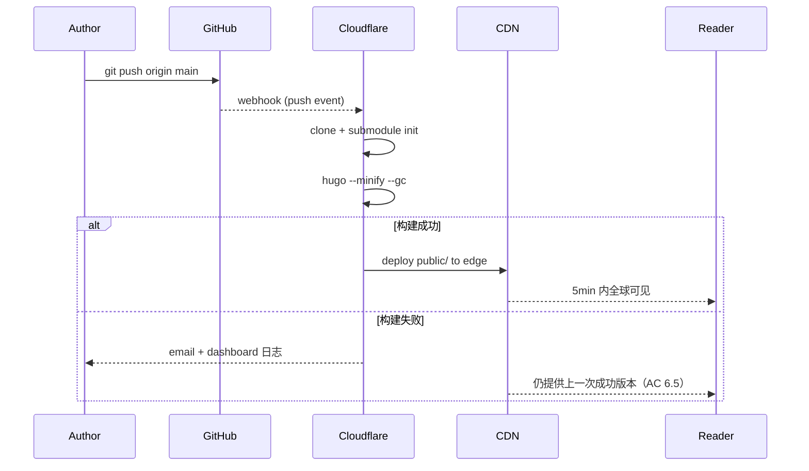

# Design Document

## Overview

本设计基于 `requirements.md` 中的全部 14 项需求，以及调研结论中针对 0 基础 Author 的默认推荐组合。设计目标是把"还在比较候选"的需求文档落地为"可以直接照着搭"的蓝图。

### 锁定技术栈（不再保留多选项）

| 维度 | 选择 | 锁定原因 |
| --- | --- | --- |
| Static_Site_Generator | **Hugo（extended 版）** | 单二进制、构建快、AI 圈采用率高（满足 AC 3.1） |
| Theme | **PaperMod**（作为 Git submodule 引入） | 极简现代博客风、维护活跃、内置暗黑模式与归档（满足 AC 3.5、AC 9） |
| Source_Repository | **GitHub**，默认分支 `main` | 满足 AC 4.1；Giscus 与 CF Pages 均依赖 GitHub |
| Hosting_Platform | **Cloudflare Pages** | 内置构建、自动 HTTPS、全球 CDN、免费额度宽松（满足 AC 5、AC 6） |
| Domain_Registrar | **Cloudflare Registrar**（或他处转入） | 成本价续费、隐私保护默认开启、与 CF Pages 同账号管理（满足 AC 2.5） |
| Comment_System | **Giscus**（默认启用） | 基于 GitHub Discussions、无需后端、与 GitHub OAuth 天然集成（满足 AC 11.3） |
| Analytics_System | **Cloudflare Web Analytics**（默认启用） | 无 Cookie、无 IP、隐私友好、无需 Consent_Banner 复杂分支（满足 AC 12.1、12.3） |
| Search_System | **Pagefind**（默认启用，构建期生成索引） | 客户端搜索、零后端（满足 AC 13.3） |
| Math 渲染 | **KaTeX** | 体积小、客户端渲染快、PaperMod 官方有集成片段（满足 AC 8.6） |
| Content_Source | **Markdown + YAML/TOML front matter** | 满足 AC 8.1、8.2 |
| 本地操作系统 | **macOS** | 来自 system_information；Setup_Checklist 仍按需求覆盖三平台 |

### "Done" 的可观察判据

最终交付的 Blog_System 必须满足以下全部条件：

1. 通过 Custom_Domain 以 `https://` 协议返回 HTTP 200，首页首屏 ≤ 3 秒可见（AC 2.2、AC 5.1）。
2. 站点至少包含：首页 `/`、关于页 `/about/`、文章列表 `/posts/`、两篇示例文章详情页（AC 7、AC 8.7）。
3. 暗 / 亮模式按系统偏好自动切换，且导航栏存在主题切换入口，状态持久化到 localStorage（AC 9.2 ~ 9.6）。
4. 站点根路径输出 `sitemap.xml`、`/index.xml`（RSS）、`robots.txt`，且 robots.txt 内含 Sitemap 指令（AC 10.3 ~ 10.5）。
5. 视口宽度在 320px ~ 1920px 范围内无横向滚动条（AC 9.1）。
6. 推送到 `main` 分支后 5 分钟内自动发布到线上（AC 6.1、6.2）。
7. Giscus 评论区在文章详情页正文末尾下方加载；Cloudflare Web Analytics 注入完成；Pagefind 搜索框在导航栏可用（AC 11.1、AC 13.1）。

---

## Architecture

### 写作 / 发布链路（构建期）



### 访客访问链路（运行期）



说明：

- Giscus、Cloudflare Web Analytics 均以单个 `<script>` 标签注入，失败时不阻塞正文（AC 11.5、AC 12.5）。
- Pagefind 索引文件随 `public/` 一起发布到 CF CDN，搜索过程零后端依赖（AC 13.6 失败时降级为提示信息）。

---

## Components and Interfaces

This section enumerates the concrete artifacts the implementation produces and the integration points each artifact exposes. Sub-sections cover repository layout, the configuration surface, the information architecture, theming hooks, optional plug-ins (Giscus / CF Analytics / Pagefind), the local dev workflow, deployment pipeline, domain plan, and SEO outputs.

### Repository Layout

实施完成后，Source_Repository 根目录结构如下（不含 `public/` 等构建产物）：

```text
personal-blog/
├── .github/
│   └── workflows/
│       └── gh-pages-backup.yml         # 备用工作流（默认禁用，见附录 A）
├── .kiro/
│   └── specs/personal-blog/            # 已存在，本设计不修改
├── archetypes/
│   └── default.md                      # hugo new 的模板
├── assets/
│   └── css/
│       └── extended/
│           └── custom.css              # PaperMod 扩展样式钩子
├── content/
│   ├── _index.md                       # 首页内容（可选）
│   ├── about.md                        # 关于我
│   └── posts/
│       ├── hello-world.md              # 示例文章 1
│       └── about-me.md                 # 示例文章 2
├── layouts/
│   └── partials/
│       ├── extend_head.html            # 注入 KaTeX CSS / JS、CF Analytics、OG 默认图
│       ├── comments.html               # Giscus 嵌入
│       └── extend_footer.html          # Pagefind 初始化（可选）
├── static/
│   ├── favicon.ico
│   ├── favicon.svg
│   ├── apple-touch-icon.png
│   ├── og-default.png                  # 站点级 OG 图（AC 10.2 默认 og:image）
│   ├── robots.txt                      # 覆写 Hugo 默认（AC 10.5）
│   └── .well-known/                    # 预留
├── themes/
│   └── PaperMod/                       # Git submodule，不入库
├── .gitignore
├── .gitmodules                         # 由 git submodule add 自动生成
├── hugo.toml                           # 主配置（选定 TOML 而非 YAML）
├── LICENSE                             # MIT 或 CC-BY-4.0
└── README.md
```

设计取舍说明：

- **配置文件格式**：选 `hugo.toml`（不用 `config.yaml`）。理由：PaperMod 官方示例与 Hugo 文档均以 TOML 为主，注释更直观。
- **主题以 submodule 引入**：仓库不复制 PaperMod 源代码，仅记录 commit。便于跟随上游更新（AC 3.5 安装步骤）。
- **`.github/workflows/`**：默认不启用 GitHub Actions，由 CF Pages 处理构建；保留 `gh-pages-backup.yml` 作为应急备份方案，详见 §9.4。
- **`static/robots.txt` 覆写**：Hugo 默认会生成 robots.txt，但其 Sitemap 指令需要显式启用；为了 AC 10.5 的"Sitemap 绝对 URL"要求，使用静态文件覆写更稳妥。
- **`.kiro/`**：已存在的 spec 目录原样保留，构建时不会被 Hugo 当作内容（不在 `content/` 下）。

`.gitignore` 关键条目：

```text
public/
resources/
.hugo_build.lock
.DS_Store
node_modules/
.env
.env.local
```

---

### Configuration Design

#### `hugo.toml` 结构（关键字段示例）

```toml
baseURL = "https://{YOUR_DOMAIN}/"
languageCode = "zh-cn"
defaultContentLanguage = "zh-cn"
title = "{YOUR_SITE_TITLE}"
theme = "PaperMod"

enableRobotsTXT = false                  # 我们用 static/robots.txt 覆写
buildDrafts = false                      # 生产构建排除 draft（AC 8.4）
buildFuture = false
buildExpired = false
enableEmoji = true
enableGitInfo = true                     # 用于 lastmod（AC 10.3）

[pagination]
  pagerSize = 10                         # 列表页每页 10 篇（AC 7.3）

[outputs]
  home = ["HTML", "RSS", "JSON"]         # JSON 供 Pagefind 备用 / 站内索引
  section = ["HTML", "RSS"]
  taxonomy = ["HTML", "RSS"]
  term = ["HTML", "RSS"]

[minify]
  disableXML = true                      # 保留 sitemap / RSS 可读性

[markup]
  [markup.highlight]
    style = "github"
    lineNos = false
    codeFences = true
    guessSyntax = true
  [markup.goldmark.renderer]
    unsafe = true                        # 允许 Markdown 内嵌 HTML（KaTeX、img 标签）
  [markup.tableOfContents]
    startLevel = 2
    endLevel = 4

[params]
  env = "production"
  author = "{YOUR_NAME}"
  description = "{YOUR_SITE_DESCRIPTION}"
  defaultTheme = "auto"                  # 暗黑模式策略（AC 9.2、9.3）
  ShowReadingTime = true
  ShowShareButtons = false
  ShowPostNavLinks = true
  ShowBreadCrumbs = true
  ShowCodeCopyButtons = true
  ShowToc = true
  TocOpen = false
  ShowRssButtonInSectionTermList = true
  math = true                            # 触发 extend_head.html 中的 KaTeX 注入

  [params.homeInfoParams]
    Title = "你好，我是 {YOUR_NAME}"
    Content = "这里是我记录想法与作品的地方。"

  [[params.socialIcons]]
    name = "github"
    url = "https://github.com/{YOUR_GH_USERNAME}"
  [[params.socialIcons]]
    name = "email"
    url = "mailto:{YOUR_EMAIL}"
  [[params.socialIcons]]
    name = "rss"
    url = "/index.xml"

  [params.assets]
    favicon = "/favicon.ico"
    favicon16x16 = "/favicon.svg"
    apple_touch_icon = "/apple-touch-icon.png"
    og_image = "/og-default.png"

  [params.giscus]
    repo = "{YOUR_GH_USERNAME}/{YOUR_REPO_NAME}"
    repoId = "{GISCUS_REPO_ID}"
    category = "Comments"
    categoryId = "{GISCUS_CATEGORY_ID}"
    mapping = "pathname"
    reactionsEnabled = "1"
    emitMetadata = "0"
    inputPosition = "bottom"
    theme = "preferred_color_scheme"
    lang = "zh-CN"

  [params.analytics.cloudflare]
    token = "{CF_WEB_ANALYTICS_TOKEN}"

  [params.fuseOpts]                      # PaperMod 内置搜索的兜底配置
    isCaseSensitive = false
    shouldSort = true
    location = 0
    distance = 1000
    threshold = 0.4
    minMatchCharLength = 0
    keys = ["title", "permalink", "summary", "content"]

[menu]
  [[menu.main]]
    identifier = "posts"
    name = "文章"
    url = "/posts/"
    weight = 10
  [[menu.main]]
    identifier = "tags"
    name = "标签"
    url = "/tags/"
    weight = 20
  [[menu.main]]
    identifier = "about"
    name = "关于"
    url = "/about/"
    weight = 30
  [[menu.main]]
    identifier = "search"
    name = "搜索"
    url = "/search/"
    weight = 40
```

> 所有 `{PLACEHOLDER}` 在实施阶段替换；提交前不允许残留任一占位符（由 §13.5 的预提交检查覆盖）。

#### 配置字段与需求条目对照

| 字段 | 满足的 AC |
| --- | --- |
| `baseURL` | 5.1、10.1（绝对 URL 用于 OG / canonical / sitemap） |
| `pagination.pagerSize = 10` | 7.3 |
| `params.defaultTheme = "auto"` | 9.2、9.3 |
| `params.math = true` | 8.6 |
| `params.giscus.*` | 11.3 |
| `params.analytics.cloudflare.token` | 12.1 |
| `[menu.main]` 4 项 | 7.8、13.1 |
| `enableRobotsTXT = false` + `static/robots.txt` | 10.5 |

---

## Data Models

### Content Model

#### Front Matter 字段表

| 字段 | 类型 | 必填 | 默认值 | 取值约束 |
| --- | --- | --- | --- | --- |
| `title` | string | 是 | — | 1 ~ 200 字符（AC 8.2） |
| `date` | string (YYYY-MM-DD 或 ISO 8601) | 是 | — | ISO 8601；构建时解析为时间戳（AC 8.2） |
| `draft` | bool | 是 | `false` | `true` 时不进入生产构建（AC 8.4） |
| `slug` | string | 否 | 由文件名派生 | 仅小写字母、数字、连字符；长度 1 ~ 100；站点内全局唯一（AC 7.4、7.5） |
| `tags` | string[] | 否 | `[]` | 数组长度 ≤ 10；每个 1 ~ 30 字符（AC 7.7、8.2） |
| `categories` | string[] | 否 | `[]` | 同 tags 约束（AC 7.7） |
| `summary` | string | 否 | 由正文前 160 字派生 | ≤ 300 字符（AC 7.2、8.2、10.2） |
| `description` | string | 否 | 同 `summary` | ≤ 160 字符；写入 `<meta name="description">`（AC 10.1） |
| `images` | string[] | 否 | `["/og-default.png"]` | 用于 og:image（AC 10.1、10.2） |
| `lastmod` | string | 否 | 取自 git 提交时间 | 用于 sitemap.xml `<lastmod>`（AC 10.3） |
| `math` | bool | 否 | `false` | 单篇启用 KaTeX 渲染（与全局 `params.math` 协同） |

> `categories` 不在 AC 8.2 必填字段中，但在 AC 7.7 中要求支持；保留为可选字段。

#### 完整示例文件

`content/posts/hello-world.md`：

```markdown
---
title: "Hello, World"
date: 2025-01-15
slug: "hello-world"
draft: false
tags: ["meta", "blog"]
categories: ["杂记"]
summary: "这是我的第一篇博客文章——为什么开始写、写些什么、以及打算怎么坚持下去。"
description: "为什么开始写博客：起点、目标与写作约定。"
images: ["/og-default.png"]
math: false
---

## 为什么写博客

这里写正文……

## 写些什么

- 学习笔记
- 项目复盘
- 工具与流程

## 写作约定

代码示例：

\`\`\`bash
echo "hello"
\`\`\`

数学示例（启用 math: true 时）：

$$
e^{i\pi} + 1 = 0
$$
```

#### 校验策略

构建前在 `archetypes/default.md` 中预填全部必填字段；构建期由 Hugo 自身的 front matter 解析失败 → 终止构建（AC 8.3）。补充检查由 §13.5 中的预提交脚本承担：slug 唯一性、tag 长度上限、`description ≤ 160`。

---

### Information Architecture and Routing

| 路径 | 由谁生成 | 内容 |
| --- | --- | --- |
| `/` | Hugo 默认 + PaperMod `homeInfoParams` | 站点欢迎 + 最新文章 |
| `/about/` | `content/about.md` | 关于我（AC 7.1） |
| `/posts/` | Hugo section list | 文章倒序列表 + 分页（AC 7.2、7.3） |
| `/posts/{slug}/` | 每篇 `.md` | 文章详情（AC 7.4） |
| `/tags/` | Hugo taxonomy list | 标签云 |
| `/tags/{tag}/` | Hugo taxonomy term | 单个标签下的文章（AC 7.7） |
| `/categories/` | Hugo taxonomy list | 分类列表 |
| `/categories/{category}/` | Hugo taxonomy term | 单个分类下的文章 |
| `/search/` | PaperMod 内置搜索页 + Pagefind UI | 搜索入口（AC 13.1） |
| `/index.xml` | Hugo 默认 RSS | 站点级 RSS（AC 10.4） |
| `/sitemap.xml` | Hugo 默认 | 站点地图（AC 10.3） |
| `/robots.txt` | `static/robots.txt` 覆写 | 含 Sitemap 指令（AC 10.5） |
| `/404.html` | `layouts/404.html`（可使用 PaperMod 默认） | 404 页（AC 7.6） |
| `/og-default.png` | `static/og-default.png` | OG 默认图 |
| `/pagefind/*` | Pagefind 构建后注入 | 搜索索引（AC 13.3） |

PaperMod 默认已经覆盖以上绝大多数路径，仅 robots.txt、og-default.png、Pagefind 索引需要我们额外处理。

---

### Theming and Styling Decisions

#### 暗黑 / 亮模式策略

实现链路（PaperMod 已内置，配置即可）：

1. `params.defaultTheme = "auto"`：首次加载时读取 `prefers-color-scheme`（AC 9.2、9.3）。
2. 导航栏右上角的太阳/月亮图标即切换入口（AC 9.4）。
3. 切换时 PaperMod 在 `<html>` 上切换 `class="dark"` 并把选择写入 `localStorage["pref-theme"]`（AC 9.5）。
4. 后续访问时优先读 `localStorage`，覆盖系统偏好（AC 9.6）。

#### 响应式

PaperMod 默认使用流式布局 + clamp 字号 + max-width 720px 内容栏，已覆盖 320px ~ 1920px 视口（AC 9.1、9.7）。验证由 §14 的 `viewport-no-overflow` 属性测试承担。

#### KaTeX 集成

`layouts/partials/extend_head.html`：

```html
{{- if or .Params.math .Site.Params.math }}
<link rel="stylesheet"
      href="https://cdn.jsdelivr.net/npm/katex@0.16.11/dist/katex.min.css"
      integrity="sha384-nB0miv6/jRmo5UMMR1wu3Gz6NLsoTkbqJghGIsx//Rlm+ZU03BU6SQNC66uf4l5+"
      crossorigin="anonymous">
<script defer
        src="https://cdn.jsdelivr.net/npm/katex@0.16.11/dist/katex.min.js"
        integrity="sha384-7zkQWkzuo3B5mTepMUcHkMB5jZaolc2xDwL6VFqjFALcbeS9Ggm/Yr2r3Dy4lfFg"
        crossorigin="anonymous"></script>
<script defer
        src="https://cdn.jsdelivr.net/npm/katex@0.16.11/dist/contrib/auto-render.min.js"
        integrity="sha384-43gviWU0YVjaDtb/GhzOouOXtZMP/7XUzwPTstBeZFe/+rCMvRwr4yROQP43s0Xk"
        crossorigin="anonymous"
        onload="renderMathInElement(document.body);"></script>
{{- end }}
```

> 单独依赖 jsdelivr CDN；如需离线/合规，可改为下载到 `static/katex/` 后改写 src（不在 MVP 中）。

#### 自定义 CSS

PaperMod 约定：`assets/css/extended/*.css` 会被自动追加到主 CSS 之后。这是我们唯一允许的样式扩展位置，避免 fork 主题。

`assets/css/extended/custom.css`（示例）：

```css
:root { --content-width: 760px; }
.post-content code { word-break: break-word; }
```

---

### Local Development Workflow

#### 一次性环境准备（macOS）

```bash
# 1. 安装 Homebrew（已装跳过）
/bin/bash -c "$(curl -fsSL https://raw.githubusercontent.com/Homebrew/install/HEAD/install.sh)"

# 2. 安装 Hugo extended（带 SCSS 支持）
brew install hugo
hugo version
# 期望输出含 "extended" 字样，例如：
# hugo v0.128.0+extended darwin/arm64 ...

# 3. 安装 git（macOS 自带，可省略）
git --version
```

#### 创建仓库并初始化项目

```bash
mkdir -p ~/code/personal-blog && cd ~/code/personal-blog
hugo new site . --force
git init -b main
git config user.name "{YOUR_NAME}"
git config user.email "{YOUR_EMAIL}"
```

#### 添加 PaperMod 主题（submodule）

```bash
git submodule add --depth=1 https://github.com/adityatelange/hugo-PaperMod.git themes/PaperMod
git submodule update --init --recursive
```

#### 写入起步配置

将 §Configuration Design 中的 `hugo.toml` 拷贝到项目根目录；将 §KaTeX 集成 中的 `extend_head.html` 写入 `layouts/partials/`；将 §Optional Enhancements 中的 `comments.html` 写入 `layouts/partials/`。

#### 建第一批内容

```bash
hugo new content/about.md
hugo new content/posts/hello-world.md
hugo new content/posts/about-me.md
# 编辑文件并把 draft 改为 false
```

#### 本地预览

```bash
hugo server -D --bind 0.0.0.0 --baseURL http://localhost:1313/
# 浏览器打开 http://localhost:1313/
```

`-D` 用于本地预览 draft；生产构建一定不带 `-D`（AC 8.4）。

#### 生产构建（本地验证）

```bash
hugo --minify --gc
# 检查 public/ 目录大小、index.html、sitemap.xml、index.xml、robots.txt
```

---

### Deployment Pipeline

#### GitHub 仓库准备

```bash
gh repo create {YOUR_GH_USERNAME}/{YOUR_REPO_NAME} --public --source=. --remote=origin
git add .
git commit -m "init: hugo site with papermod"
git push -u origin main
```

> 没有 `gh` CLI 时改为在 GitHub 网页创建 + `git remote add origin ...` + `git push -u origin main`。

#### Cloudflare Pages 项目设置

| 设置项 | 值 |
| --- | --- |
| Production branch | `main` |
| Framework preset | Hugo |
| Build command | `hugo --minify --gc` |
| Build output directory | `public` |
| Root directory | `/` |
| Environment variables | `HUGO_VERSION=0.128.0` |
| Node version | 不需要（Hugo 是单二进制） |
| Submodule | 在 "Settings → Builds & deployments → Build configurations" 中确保 `Include submodules` 勾选 |

#### 构建与发布链路



#### 备用工作流（GitHub Actions → GitHub Pages）

为防 CF Pages 不可用或额度耗尽，附录 A 提供 `gh-pages-backup.yml`，默认 `on:` 触发器为空，需要手动启用。结构骨架：

```yaml
name: gh-pages-backup
on:
  workflow_dispatch:
permissions:
  contents: read
  pages: write
  id-token: write
jobs:
  build-deploy:
    runs-on: ubuntu-latest
    steps:
      - uses: actions/checkout@v4
        with:
          submodules: recursive
          fetch-depth: 0
      - uses: peaceiris/actions-hugo@v3
        with:
          hugo-version: '0.128.0'
          extended: true
      - run: hugo --minify --gc
      - uses: actions/upload-pages-artifact@v3
        with:
          path: ./public
      - uses: actions/deploy-pages@v4
```

#### 分支策略与预览

- `main` → Production（绑定 Custom_Domain）。
- 任意非 `main` 分支 → 自动预览 `https://<branch>.<project>.pages.dev`，CF Pages 默认行为，无需配置。
- PR → Preview deployment 注释自动出现在 PR 中。

---

### Domain and DNS Plan

#### 推荐：apex 主域，www 重定向到 apex

| URL | 行为 |
| --- | --- |
| `https://example.com/` | 200，主站 |
| `https://www.example.com/` | 301 → `https://example.com/`（CF Pages 自定义域名 UI 中勾选） |
| `http://example.com/*` | 308 → `https://example.com/*`（AC 5.4） |

#### Cloudflare Registrar 场景下的 DNS 记录

域名注册在 Cloudflare 时，DNS 区域天然在 Cloudflare 上。绑定流程：

1. CF Pages 项目 → Custom domains → 输入 `example.com`。
2. 由于 CF Pages 与 DNS 同账户，Cloudflare 会自动创建 `CNAME example.com → {project}.pages.dev` 并启用 CNAME flattening（apex 不再需要 ALIAS / ANAME）。
3. 重复以上步骤添加 `www.example.com`，并在 CF Pages 域名设置中勾选 "Redirect www to apex"。
4. SSL/TLS 模式保持 "Full (strict)"；CF 自动签发 Universal SSL（AC 5.2）。

#### 域名转入 Cloudflare（如已注册在他处）

- 前置：原 Registrar 注册满 60 天（AC 2.5）；解锁域名、获取 EPP/Auth code、关闭隐私保护以收转入邮件。
- 转入价格：成本价；转入即续 1 年。
- 转入完成前：可以先把 NS 改到 Cloudflare 提前接管 DNS 与 HTTPS。

#### 验证步骤（AC 5.5）

```bash
dig +short example.com
dig +short www.example.com
curl -I https://example.com/
curl -I http://example.com/         # 期望 308 / Location: https://...
curl -I https://www.example.com/    # 期望 301 / Location: https://example.com/
```

---

### Optional Enhancements

三项默认全部启用（用户偏好）。每项给出"是什么 / 集成点 / 关闭方式"。

#### Giscus（评论）

**是什么**：基于 GitHub Discussions 的评论组件，用 iframe 嵌入。

**集成点**：

1. 仓库 → Settings → Features → 勾选 Discussions。
2. 安装 Giscus GitHub App：<https://github.com/apps/giscus>，授权目标仓库。
3. 访问 <https://giscus.app/zh-CN> 生成配置，复制 `data-repo-id` 与 `data-category-id`，填入 `hugo.toml` 的 `params.giscus`。
4. `layouts/partials/comments.html`（覆写 PaperMod 同名 partial）：

   ```html
   {{- with .Site.Params.giscus }}
   <script src="https://giscus.app/client.js"
           data-repo="{{ .repo }}"
           data-repo-id="{{ .repoId }}"
           data-category="{{ .category }}"
           data-category-id="{{ .categoryId }}"
           data-mapping="{{ .mapping }}"
           data-strict="0"
           data-reactions-enabled="{{ .reactionsEnabled }}"
           data-emit-metadata="{{ .emitMetadata }}"
           data-input-position="{{ .inputPosition }}"
           data-theme="{{ .theme }}"
           data-lang="{{ .lang }}"
           data-loading="lazy"
           crossorigin="anonymous"
           async>
   </script>
   {{- end }}
   ```

5. PaperMod 在 `params.comments = true` 时会调用 `partials/comments.html`，因此还需在 `hugo.toml` `[params]` 下加 `comments = true`。

**关闭方式**：在 `hugo.toml` 中把 `params.comments` 设为 `false`。覆盖 PaperMod 内部的 if-guard，保证 §AC 11.2"不发起任何第三方请求"。

**失败兜底**：iframe 加载失败时仅评论区位置空白，正文照常呈现（AC 11.5）。

#### Cloudflare Web Analytics（统计）

**是什么**：CF 的隐私友好统计，**不写 Cookie、不收集 IP**，因此**无需 Consent_Banner**（AC 12.3 的同意横幅在"采集识别性 Cookie"时才必须；CF Web Analytics 不写 Cookie，按 AC 12.1 即可直接启用）。

**集成点**：

1. CF Dashboard → Analytics & Logs → Web Analytics → Add a site → 输入 `example.com` → 拷贝 `data-cf-beacon` 中的 `token`。
2. 写入 `hugo.toml` 的 `params.analytics.cloudflare.token`。
3. 在 `extend_head.html` 末尾追加：

   ```html
   {{- with .Site.Params.analytics.cloudflare.token }}
   <script defer
           src="https://static.cloudflareinsights.com/beacon.min.js"
           data-cf-beacon='{"token": "{{ . }}"}'></script>
   {{- end }}
   ```

**关闭方式**：清空 `params.analytics.cloudflare.token`；模板在 token 为空时不输出 script。

**失败兜底**：`defer` + 与正文渲染解耦，beacon 加载失败浏览器仅 console 报错，不阻塞渲染（AC 12.5）。

#### Pagefind（站内搜索）

**是什么**：构建期对 `public/` 全文索引、运行期纯客户端检索。

**集成点**：

1. CF Pages 构建命令改为：

   ```bash
   hugo --minify --gc && npx -y pagefind --site public
   ```

2. PaperMod 自带 `/search/` 页面（基于 fuse.js）。两套搜索二选一，本设计选 Pagefind：在 `layouts/search.html` 中替换为 Pagefind UI：

   ```html
   <link href="/pagefind/pagefind-ui.css" rel="stylesheet">
   <div id="search"></div>
   <script src="/pagefind/pagefind-ui.js"></script>
   <script>
     window.addEventListener('DOMContentLoaded', () => {
       new PagefindUI({ element: "#search", showSubResults: true });
     });
   </script>
   ```

3. 导航菜单中的 "搜索" 指向 `/search/`（AC 13.1）。

**关闭方式**：把 CF Pages 构建命令改回 `hugo --minify --gc`，并删除 `layouts/search.html` 或改回 PaperMod 默认。

**失败兜底**：Pagefind 索引文件缺失时显示加载失败提示，搜索框依然可见（AC 13.6）。

---

### SEO and Feeds

#### Hugo 默认产物

Hugo 在 `hugo --minify --gc` 后默认在 `public/` 输出：

- `sitemap.xml`：列出全部已发布页面，带 `<loc>` 与 `<lastmod>`（AC 10.3）。
- `index.xml`：站点级 RSS（AC 10.4）。
- 各 section / taxonomy 也各自生成 `index.xml`（PaperMod 在标签页角落显示 RSS 图标，AC 10.4 满足）。

#### robots.txt 覆写（AC 10.5）

`static/robots.txt`：

```text
User-agent: *
Allow: /

Sitemap: https://{YOUR_DOMAIN}/sitemap.xml
```

> baseURL 中的占位符在构建期不会被替换静态文件；因此此 URL 必须在上线前手工改为真实域名。属性 §14 的 `robots-sitemap-absolute` 会校验。

#### OG / meta 策略

- 每篇文章可在 front matter 提供 `images: ["/path/to/cover.png"]`；缺失时回退到 `params.assets.og_image = "/og-default.png"`（AC 10.2）。
- `description` 缺失时由 PaperMod 自动取正文前 70 字 → 但为满足 AC 10.2"不超过 160 字符"，需要在 `extend_head.html` 中显式截断：

   ```html
   {{- $desc := .Description | default .Summary | default (.Plain | truncate 160) }}
   <meta name="description" content="{{ $desc | truncate 160 }}">
   <meta property="og:description" content="{{ $desc | truncate 160 }}">
   ```

- `title` 同样在 `extend_head.html` 中限制 ≤ 70 字符：

   ```html
   {{- $title := .Title | default .Site.Title | truncate 70 }}
   <title>{{ $title }}</title>
   <meta property="og:title" content="{{ $title }}">
   ```

- og:type：详情页为 `article`，其他为 `website`（PaperMod 默认行为）。

#### Search Console 接入（AC 10.7）

1. 选 "HTML 标签验证"：复制 `<meta name="google-site-verification" content="..." />`，写入 `extend_head.html`。
2. 部署后回到 Search Console 点 "验证"。
3. 在 "站点地图" 提交 `https://{YOUR_DOMAIN}/sitemap.xml`。
4. 完成判据：`sitemap.xml` 状态变为 "Success" 且开始展示 "Discovered URLs"。

---

## Error Handling

| 场景 | 行为 | 关联 AC |
| --- | --- | --- |
| 同 slug 冲突 | 构建期 Hugo 报 `permalink ... already exists` 并以非零退出码终止；CF Pages 构建失败邮件告警 | 7.5 |
| 非法 slug（含大写或长度 > 100） | 由预提交脚本（§13.5）拦截，不让冲突进入仓库 | 7.4、7.5 |
| 缺必填 front matter | Hugo 报错并退出，CF Pages 构建状态变红 | 8.3 |
| `draft: true` | `buildDrafts = false` 下默认排除；预提交脚本额外校验 `public/` 中不应出现该文件 | 8.4 |
| 访问不存在 URL | PaperMod 默认 404 模板，含返回首页与文章列表链接 | 7.6 |
| TLS 续期失败 | CF 控制台 + 邮件告警，原证书继续服务直到过期 | 5.3 |
| 构建超过 15 分钟 | CF Pages 强制中止；通过邮件 + 日志链接通知 | 6.3 |
| Giscus / Pagefind / CF Analytics 加载失败 | 各自 `defer` 异步，不阻塞正文 | 11.5、12.5、13.6 |
| 视口 < 320px 或 > 1920px | 不在保证范围内，但 PaperMod 流式布局通常仍可用 | 9.1 |

### 预提交检查（本地脚本，附录 B）

`scripts/preflight.sh`，在 `git commit` 前手工运行（也可挂 husky）：

1. 检查 `hugo.toml` 中无 `{...}` 占位符。
2. 检查 `static/robots.txt` Sitemap 行域名与 `baseURL` 一致。
3. 解析 `content/posts/*.md` front matter，校验 slug 格式与全局唯一。
4. 校验每篇文章 `description` ≤ 160、`title` ≤ 70（与 §14 属性测试一致）。
5. 运行 `hugo --minify --gc` 并对 `public/` 跑链接检查。

---


## Correctness Properties

> *A property is a characteristic or behavior that should hold true across all valid executions of a system—essentially, a formal statement about what the system should do. Properties serve as the bridge between human-readable specifications and machine-verifiable correctness guarantees.*

PBT 适用性评估：本特性主要由 Hugo 静态构建驱动，**构建产物层**有大量"对任意输入内容集合，产物文件应满足某项 invariant"的规则，非常适合 PBT；**输入校验层**（slug、front matter）也是经典 validator PBT 场景。运行期表现（CDN、HTTPS、CF Pages 构建/通知、Giscus iframe、Pagefind 性能）属于第三方基础设施，按 prework 分类为 INTEGRATION，不进入此节。

下列属性按 prework 反思后的最终保留集编号；每条都是"对任意有效输入，产物应满足 X"的形式，可由生成器制造 fixture 内容集合后跑一次 `hugo --minify --gc` 并解析 `public/` 进行验证。

### Property 1: Slug 字符集与长度校验

*For any* 字符串 `s`，slug 校验器接受 `s` 当且仅当 `s` 长度在 `[1, 100]` 范围内、且 `s` 仅包含小写字母、数字与连字符 `-`。

**Validates: Requirements 7.4**

### Property 2: Slug 全局唯一是构建成功的必要条件

*For any* 已发布文章集合 `P`（即 `draft != true` 的子集），如果 `P` 中存在两篇文章具有相同的 `slug`（或由文件名派生的等价 slug），则 `hugo --minify --gc` 必定以非零退出码终止；反之若 `P` 中所有 slug 两两不同，则该构建步骤不应因 slug 冲突而失败。

**Validates: Requirements 7.4, 7.5**

### Property 3: Front Matter 校验决定单篇文章可发布性

*For any* 单篇 Markdown 文件 `m`，如果 `m` 的 front matter 缺少必填字段（`title`、`date`、`draft` 之一）或任一字段不满足 §5.1 的类型/长度约束（`title ≤ 200`、`date` 为 ISO 8601、`tags` 为字符串数组且 `len ≤ 10`、`summary ≤ 300`、`description ≤ 160`），那么包含 `m` 的构建必定以非零退出码终止；反之若 `m` 字段全部合规，则不应因 `m` 自身导致构建失败。

**Validates: Requirements 8.2, 8.3**

### Property 4: Draft 隔离

*For any* 文章集合 `P`，对 `P` 中任意 `draft: true` 的文章 `d`，构建产物 `public/` 内：

1. 不存在 `public/posts/{d.slug}/index.html`；
2. 任何列表页（首页、`/posts/`、`/tags/*`、`/categories/*`）的 HTML 中均不出现指向 `d` 的链接；
3. `sitemap.xml` 与 `index.xml` 中均不出现 `d` 的 `loc` 或 `link`。

**Validates: Requirements 8.4, 10.3**

### Property 5: Sitemap 完备性

*For any* 已发布文章集合 `P` 与已使用过的 tag/category 集合 `T`，构建产物 `public/sitemap.xml` 中 `<loc>` 元素集合恰好等于 `{ /, /about/, /posts/, /tags/, /categories/, /search/ } ∪ { /posts/{p.slug}/ | p ∈ P } ∪ { /tags/{t}/ | t ∈ T(tags) } ∪ { /categories/{c}/ | c ∈ T(categories) }`，且每个 `<loc>` 在 sitemap 中恰好出现一次，每条 entry 同时含 `<lastmod>` 字段。

**Validates: Requirements 10.3, 7.7, 8.4**

### Property 6: RSS 与列表的倒序配额

*For any* 已发布文章集合 `P`，令 `N = min(10, |P|)`，则 `public/index.xml` 中 `<item>` 元素的前 `N` 条按 `<pubDate>` 严格降序排列，且这 `N` 条对应 `P` 中按 `date` 降序排序后的前 `N` 篇。同样的顺序约束也成立于 `public/posts/index.html` 与 `public/index.html` 中的最新文章列表。

**Validates: Requirements 7.2, 10.4**

### Property 7: 分页约束

*For any* 已发布文章集合 `P` 与文章列表入口（`/posts/`、`/tags/{t}/`、`/categories/{c}/`），分页后每个生成的列表页（`page/1/`、`page/2/`、…）中文章链接条目数 `≤ 10`，且 `P` 中每篇文章在该入口的所有分页中作为列表项出现的次数 `= 1`。

**Validates: Requirements 7.3**

### Property 8: Tag 聚合完备性

*For any* 已发布文章 `p` 与 `p.tags` 中任意标签 `t`，构建产物 `public/tags/{slugify(t)}/index.html` 必定存在，且其 HTML 中包含一个指向 `p` 详情页的链接 `/posts/{p.slug}/`。对 `categories` 同样成立。

**Validates: Requirements 7.7**

### Property 9: 统一导航

*For any* 公开 HTML 页面 `H ∈ public/**/*.html`（含首页、关于页、文章详情页、列表页、聚合页、404、search），`H` 的 nav 区块包含三条可点击链接：分别指向 `/`、`/posts/`、`/about/`；且当前页所属导航项以 PaperMod 提供的 `active` 类（或等价高亮 class）标记。

**Validates: Requirements 7.8**

### Property 10: SEO Meta 约束与缺省回退

*For any* 公开 HTML 页面 `H ∈ public/**/*.html`：

1. `<title>` 文本长度 `≤ 70`；
2. `<meta name="description">` 的 `content` 长度 `≤ 160`；
3. `<head>` 中含 `og:title`、`og:description`、`og:image`、`og:url`、`og:type` 五个 `<meta property="...">`；
4. 当 `H` 对应文章未声明 `description` 时，`<meta name="description">` 的内容等于 `H` 对应文章正文前 ≤160 字符的纯文本截断；当未声明 `images` 时，`og:image` 等于 `params.assets.og_image`；
5. 文章详情页的 `og:type = article`，其余页面 `og:type = website`。

**Validates: Requirements 10.1, 10.2**

### Property 11: Giscus 注入双向条件

*For any* 构建配置 `C` 与已发布文章 `p`：

- 若 `C.params.comments == true` 且 `C.params.giscus.repo` 非占位符，则 `public/posts/{p.slug}/index.html` 中含 `<script>` 标签其 `src` 指向 `https://giscus.app/client.js` 且 `data-repo` 属性等于 `C.params.giscus.repo`；
- 若 `C.params.comments == false`（或 giscus 配置缺省），则 `public/**/*.html` 中均不出现字符串 `giscus.app`，构建产物对 giscus 域不发起任何形式的引用。

**Validates: Requirements 11.1, 11.2**

### Property 12: Analytics 脚本异步注入

*For any* 启用了 `params.analytics.cloudflare.token` 的构建产物 `H ∈ public/**/*.html`，`H` 中指向 `static.cloudflareinsights.com/beacon.min.js` 的 `<script>` 标签必定带有 `defer` 属性（或 `async` 属性），且位于 `<head>` 末尾或 `<body>` 末尾，从而不阻塞渲染主路径。

**Validates: Requirements 12.5**

### Property 13: 搜索入口可达

*For any* 启用了 Pagefind 的构建产物：`public/pagefind/pagefind.js` 与至少一个 `pagefind/index/*.pf_*` 索引文件存在；`public/search/index.html` 存在；且 `public/**/*.html` 的 nav 区块均含一条 `href="/search/"` 的链接。

**Validates: Requirements 13.1, 13.3**

### Property 14: 内部链接全部可解析

*For any* 构建产物 `H ∈ public/**/*.html` 与 `H` 中以 `/` 起始的相对 URL `u`（即同源内部链接），存在 `public${u}` 或 `public${u}/index.html` 或 `public${u}.html` 中的至少一个为真实文件。

**Validates: Requirements 7.4, 7.6, 7.7, 10.3, 10.4**

### Property 15: 构建确定性

*For any* 同一份源仓库（同一 git commit）与同一份 `hugo.toml`，连续执行两次 `hugo --minify --gc` 后，`public/` 中除以下白名单字段外，对应文件应字节相同：

- 任意 RSS / sitemap 中的 `<lastBuildDate>`；
- 任意 HTML 中由 `now` 派生的时间戳；
- 任意由 `enableGitInfo` 引入的 `lastmod`（受 git 状态影响）。

**Validates: Requirements 6.2**

---

## Open Questions and Placeholders

实施进入 Tasks 前，必须从用户处收集以下输入。所有 `{PLACEHOLDER}` 在上线前应被替换。

| # | 字段 | 用途 | 默认 / 备选 | 何时必须填 |
| --- | --- | --- | --- | --- |
| Q1 | `{YOUR_DOMAIN}`（如 `example.com`） | `baseURL`、robots.txt Sitemap 行、CF Pages Custom domain | — | §10 域名绑定前 |
| Q2 | `{YOUR_NAME}` | `params.author`、git config user.name | — | §8.2 之前 |
| Q3 | `{YOUR_EMAIL}` | `socialIcons` 邮箱、git config user.email | — | §8.2 之前 |
| Q4 | `{YOUR_GH_USERNAME}` | `socialIcons` GitHub、Source_Repository 创建 | — | §9.1 之前 |
| Q5 | `{YOUR_REPO_NAME}` | Source_Repository 名 | 默认 `personal-blog` | §9.1 之前 |
| Q6 | `{YOUR_SITE_TITLE}` | `title`、OG | — | §8.4 之前 |
| Q7 | `{YOUR_SITE_DESCRIPTION}` | `params.description`、OG description fallback | — | §8.4 之前 |
| Q8 | `{GISCUS_REPO_ID}` / `{GISCUS_CATEGORY_ID}` | Giscus 配置 | 由 giscus.app 生成 | §11.1 启用时 |
| Q9 | `{CF_WEB_ANALYTICS_TOKEN}` | CF Web Analytics beacon token | 由 CF 仪表盘生成 | §11.2 启用时 |
| Q10 | "关于我"正文 | `content/about.md` | — | §8.5 之前 |
| Q11 | 两篇示例文章正文 | `content/posts/hello-world.md` 与 `about-me.md` | — | §8.5 之前 |
| Q12 | OG 默认图 `static/og-default.png` | OG 图回退 | 1200×630 PNG，可先用占位图 | §12.3 之前 |
| Q13 | 是否在首发即启用搜索 / 评论 / 分析 | 决定 §11 三项是否纳入首版构建命令 | 默认全部启用 | §9.2 之前 |
| Q14 | License 选择 | LICENSE 文件 | 默认 MIT | §3 仓库初始化时 |

---

## Testing Strategy

本特性的测试组合分为五类：

### 文档审计（Smoke）

针对 prework 中分类为 SMOKE 的所有 AC（调研结论、对比表、Setup_Checklist 完整性）。

- **方式**：单次执行的 markdown 校验脚本 `scripts/audit-checklist.sh`。
- **覆盖**：`docs/setup-checklist.md` 含规定的 7 个一级章节、每章四类条目小标题、预算估算 5 行 5 列、排查清单 5 场景 4 字段（AC 14.1–14.6）。
- **运行频率**：每次 PR + 上线前。
- **运行次数**：1 次/检查项；不属于 PBT。

### 单元测试 / Validator（Example + 部分 Property）

针对纯函数式逻辑，例如 slug 校验器（Property 1）、front matter 校验器（Property 3 的本地实现）。

- **方式**：选用项目语言对应的 PBT 库（推荐 [`fast-check`](https://fast-check.dev/) + `vitest`，因为 Pagefind/Node 工具链已存在；或用 [`hypothesis`](https://hypothesis.readthedocs.io/) + `pytest`，二选一）。
- **配置**：每个 property 测试至少 100 次迭代。
- **Tag 格式（写入测试代码注释）**：`Feature: personal-blog, Property {N}: {short title}`。

### 构建产物属性测试（核心 PBT）

针对 Property 2、4、5、6、7、8、9、10、11、12、13、14、15。

- **方式**：测试驱动器生成随机 fixture 内容（一组 posts，每篇含随机 title/slug/date/tags/draft/description），写入临时 `content/posts/`，运行 `hugo --minify --gc`，再用 jsdom / cheerio / fast-xml-parser 解析 `public/`，对每条 property 断言。
- **生成器策略**：
  - posts 数量分布在 `[0, 30]`，覆盖空集、刚好 10 篇分页边界、跨多页边界；
  - title 含中英文混合 + emoji + 长字符串以触发 70 字符上限；
  - description 故意省略以触发回退（覆盖 Property 10 的 EDGE_CASE 部分）；
  - tags 故意含 unicode、空格、>30 字符以试探 slugify 与 AC 7.7 长度上限；
  - draft 比例约 30% 以保证 Property 4 同一构建中混合 draft/published。
- **配置**：每个 property 测试至少 100 次构建迭代。考虑到 `hugo` 单次构建在 100 篇以下场景通常 < 1 秒，100 次成本可接受；若需要降低成本，可对生成器使用 `fc.commands` / shrink 控制。
- **Tag 格式**：`Feature: personal-blog, Property {N}: {short title}`。

### 端到端集成测试（Integration / Smoke）

针对 prework 中分类为 INTEGRATION 的 AC：HTTPS 协议、HTTP→HTTPS 重定向、TLS、CF Pages webhook、Giscus iframe、Pagefind UI、跨浏览器布局。

- **方式**：1–3 个代表性样例，使用 `curl`、`playwright` 或 BrowserStack；不在 PBT 内重复迭代 100 次。
- **运行频率**：上线后一次性 + 关键变更后。

### 视觉回归与响应式快照（Example）

针对 Property 不便覆盖的 AC 9.1、9.2–9.6（暗黑模式与视口）。

- **方式**：playwright 在 320 / 768 / 1280 / 1920 四视口对首页 + 一篇文章详情页截图，断言 `document.documentElement.scrollWidth ≤ window.innerWidth`；切换主题后再截一组。
- **配置**：每视口 1 次，不属于 PBT。

### PBT 库选型与运行约定

| 项 | 决定 |
| --- | --- |
| 语言 / 工具链 | Node.js + TypeScript（与 Pagefind / 前端生态一致） |
| PBT 库 | `fast-check` |
| 测试 runner | `vitest --run`（避免 watch 模式） |
| 每个 property 最少迭代 | 100 次 |
| 报告失败示例 | 启用 `verbose: 2` 与 `seed` 复现 |
| 构建期 fixture 临时目录 | `tmp/pbt-{rand}/`，测试结束清理 |
| Hugo 版本 | 与生产一致：`HUGO_VERSION=0.128.0`（CI 中通过 setup-hugo action 锁定） |

测试代码所在目录约定：`tests/properties/*.test.ts`（运行时）、`tests/fixtures/`（手工 example fixture）、`tests/build/*.test.ts`（构建产物属性）。这些目录在 Tasks 阶段创建，本设计仅约定结构。

---

## Appendix

### Appendix A. `gh-pages-backup.yml` 完整骨架

```yaml
# .github/workflows/gh-pages-backup.yml
name: gh-pages-backup
on:
  workflow_dispatch:           # 默认仅手动触发
permissions:
  contents: read
  pages: write
  id-token: write
concurrency:
  group: "pages"
  cancel-in-progress: true
jobs:
  build:
    runs-on: ubuntu-latest
    env:
      HUGO_VERSION: 0.128.0
    steps:
      - uses: actions/checkout@v4
        with:
          submodules: recursive
          fetch-depth: 0
      - name: Setup Hugo
        uses: peaceiris/actions-hugo@v3
        with:
          hugo-version: ${{ env.HUGO_VERSION }}
          extended: true
      - name: Build
        run: hugo --minify --gc --baseURL "${{ steps.pages.outputs.base_url }}/"
      - name: Setup Pages
        id: pages
        uses: actions/configure-pages@v5
      - name: Upload artifact
        uses: actions/upload-pages-artifact@v3
        with:
          path: ./public
  deploy:
    needs: build
    runs-on: ubuntu-latest
    environment:
      name: github-pages
      url: ${{ steps.deployment.outputs.page_url }}
    steps:
      - id: deployment
        uses: actions/deploy-pages@v4
```

启用条件：CF Pages 不可用时，把 `on:` 改为 `push: { branches: [main] }` 并将 GitHub Pages 设为该 workflow 部署源。

---

### Appendix B. `scripts/preflight.sh` 关键检查项（伪代码）

```bash
#!/usr/bin/env bash
set -euo pipefail

# 1. 配置占位符检查
grep -nE '\{[A-Z_]+\}' hugo.toml && {
  echo "[FAIL] 残留占位符"; exit 1; }

# 2. robots.txt 与 baseURL 一致性
BASE=$(grep -E '^baseURL' hugo.toml | sed -E 's/.*"(.*)\/".*/\1/')
grep -F "Sitemap: ${BASE}/sitemap.xml" static/robots.txt > /dev/null

# 3. slug 唯一性
python3 scripts/check_slugs.py content/posts

# 4. front matter 字段约束
python3 scripts/check_frontmatter.py content/posts

# 5. 构建 + 链接检查
hugo --minify --gc
node scripts/check_internal_links.mjs public
```

---

### Appendix C. 依赖版本锁定建议

| 依赖 | 版本 | 锁定方式 |
| --- | --- | --- |
| Hugo extended | 0.128.0（或当前稳定版） | `HUGO_VERSION` env var（CF Pages + GH Actions） |
| PaperMod | submodule commit | `git submodule update --remote` 升级，commit 入库 |
| Pagefind | npm `pagefind@^1.1` | 由 `npx -y pagefind@1.1.0 ...` 固定 |
| KaTeX | 0.16.11 | jsdelivr URL + SRI hash（见 §7.3） |

升级策略：每季度评估一次 PaperMod 与 Pagefind 上游变更；Hugo 版本紧跟 CF Pages 默认支持的 LTS。
