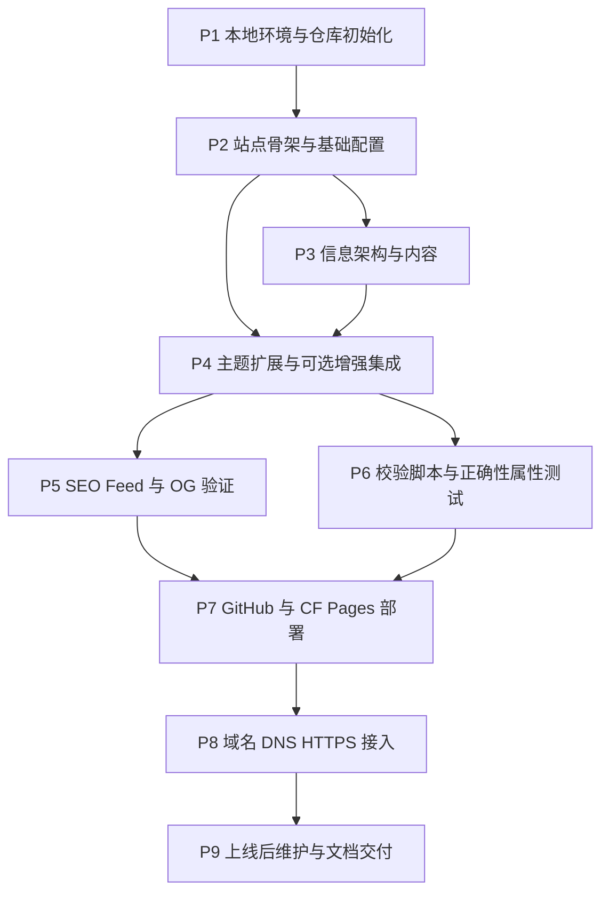

# Implementation Plan: personal-blog

## Overview

把 `requirements.md` 的 14 项需求与 `design.md` 锁定的技术栈（Hugo extended 0.128.0 + PaperMod submodule + GitHub + Cloudflare Pages + Cloudflare Registrar + Giscus + Cloudflare Web Analytics + Pagefind + KaTeX）拆解为可逐条执行的任务。整体分为 9 个阶段（P1–P9），每个阶段对应 `design.md` 中的一个 Component 区块。命令以 macOS / zsh 为主；所有真实业务值（域名、用户名、邮箱、Token 等）以 `{PLACEHOLDER}` 形式预留，构建任务 8.4 会统一替换。

带 `[手动]` 前缀的子任务必须由人类在第三方控制台或物理设备上完成（注册账号、付费、点 DNS UI、安装 GitHub App、Search Console 验证）。带 `*` 后缀的子任务（`- [ ]*`）为可选测试任务，跳过不会阻塞主链路；其余子任务必须执行。

执行 `tasks.md` 中所列工作时，目标仓库根目录是 `~/code/personal_blog`（与当前 spec 所在工作区路径 `/Users/mi/code/personal_blog` 一致），spec 目录 `.kiro/specs/personal-blog/` 不要覆写。

## Tasks

- [ ] 1. P1：本地环境与仓库初始化
  - 安装本地工具链、初始化 git 仓库、引入 PaperMod 主题，得到一个可被 Hugo 识别的空骨架。

  - [x] 1.1 安装 Hugo extended（macOS）
    - 检查 Homebrew：`brew --version`；未安装则执行 `/bin/bash -c "$(curl -fsSL https://raw.githubusercontent.com/Homebrew/install/HEAD/install.sh)"`
    - 安装 Hugo：`brew install hugo`
    - 验证：`hugo version`，输出必须包含 `extended` 字样且版本 ≥ `0.128.0`，例如 `hugo v0.128.0+extended darwin/arm64 ...`
    - 若版本过低：`brew upgrade hugo`
    - _Requirements: 3.2_

  - [x] 1.2 [手动] 准备 GitHub 账号与 SSH 公钥
    - 已有 GitHub 账号则跳过注册；否则在 https://github.com/signup 注册并完成邮箱验证
    - 生成 SSH key：`ssh-keygen -t ed25519 -C "{YOUR_EMAIL}" -f ~/.ssh/id_ed25519 -N ""`（已有同名文件则跳过）
    - 启动 ssh-agent 并加入私钥：`eval "$(ssh-agent -s)" && ssh-add --apple-use-keychain ~/.ssh/id_ed25519`
    - 复制公钥到剪贴板：`pbcopy < ~/.ssh/id_ed25519.pub`
    - 在浏览器打开 https://github.com/settings/ssh/new，标题填 `personal-blog-mac`，粘贴公钥并保存
    - 验证：`ssh -T git@github.com`，应输出 `Hi {YOUR_GH_USERNAME}! You've successfully authenticated, but GitHub does not provide shell access.`
    - _Requirements: 4.2_

  - [x] 1.3 初始化本地工程目录与 git 仓库
    - 创建并进入工程目录：`mkdir -p ~/code/personal_blog && cd ~/code/personal_blog`
    - 由于 `.kiro/` 已存在，使用 `--force` 让 Hugo 在非空目录初始化骨架：`hugo new site . --force`
    - 初始化 git 仓库（默认分支 `main`）：`git init -b main`
    - 配置仓库级 git 身份（也可以全局 `git config --global`）：
      - `git config user.name "{YOUR_NAME}"`
      - `git config user.email "{YOUR_EMAIL}"`
    - 验证：`ls -la` 应能看到 `archetypes/`、`content/`、`data/`、`layouts/`、`static/`、`themes/`、`hugo.toml`；`git status` 应显示 `On branch main`
    - _Requirements: 3.3, 4.1, 4.2_

  - [x] 1.4 引入 PaperMod 主题（Git submodule）
    - 仍在仓库根目录执行：`git submodule add --depth=1 https://github.com/adityatelange/hugo-PaperMod.git themes/PaperMod`
    - 拉取 submodule 内容：`git submodule update --init --recursive`
    - 验证：`ls themes/PaperMod/layouts/_default/` 应能看到 `baseof.html`；`cat .gitmodules` 应包含 `[submodule "themes/PaperMod"]`
    - _Requirements: 3.5_

  - [x] 1.5 编写根级 .gitignore、LICENSE、README.md
    - 创建 `.gitignore`，内容：
      ```text
      public/
      resources/
      .hugo_build.lock
      .DS_Store
      node_modules/
      .env
      .env.local
      tmp/
      ```
    - 创建 `LICENSE`：到 https://choosealicense.com/licenses/mit/ 复制 MIT 文本，把 `[year]` 替换成当前年份、`[fullname]` 替换成 `{YOUR_NAME}`
    - 创建 `README.md`，内容至少包含项目名 `personal-blog`、一段简介、本地预览命令 `hugo server -D`、构建命令 `hugo --minify --gc`
    - 验证：`git status` 应显示 `.gitignore`、`LICENSE`、`README.md` 三个未跟踪文件
    - _Requirements: 4.3_

  - [-] 1.6 P1 检查点 — 提交骨架
    - `git add .gitmodules themes .gitignore LICENSE README.md archetypes layouts content static hugo.toml data 2>/dev/null || true`
    - `git add -A`
    - `git commit -m "chore: init hugo skeleton with papermod submodule"`
    - 验证：`git log --oneline` 应至少看到一条提交；`git submodule status` 应输出一行 PaperMod commit 哈希
    - 若有问题，向用户确认后再继续。

- [ ] 2. P2：站点骨架与基础配置
  - 用 `design.md §Configuration Design` 的字段写好 `hugo.toml`，配齐 favicon、OG 默认图等静态占位资源，使本地 `hugo server` 能起 PaperMod 默认首页。

  - [x] 2.1 写入 hugo.toml 主配置
    - 用 `design.md §Configuration Design` 中的完整 TOML 覆盖根目录 `hugo.toml`（`hugo new site .` 生成的同名文件）
    - 关键字段（不要漏）：`baseURL = "https://{YOUR_DOMAIN}/"`、`theme = "PaperMod"`、`enableRobotsTXT = false`、`buildDrafts = false`、`enableGitInfo = true`、`pagination.pagerSize = 10`、`outputs.home = ["HTML", "RSS", "JSON"]`、`markup.goldmark.renderer.unsafe = true`、`params.defaultTheme = "auto"`、`params.math = true`、`params.comments = true`、四条 `[[menu.main]]`（首页/文章/标签/关于/搜索；首页用 PaperMod 自带，无需在 menu 列出）
    - placeholder 必须保留为字面量 `{YOUR_DOMAIN}` `{YOUR_NAME}` `{YOUR_EMAIL}` `{YOUR_GH_USERNAME}` `{YOUR_REPO_NAME}` `{YOUR_SITE_TITLE}` `{YOUR_SITE_DESCRIPTION}` `{GISCUS_REPO_ID}` `{GISCUS_CATEGORY_ID}` `{CF_WEB_ANALYTICS_TOKEN}`，等到 P8 任务 8.4 一次性替换
    - 验证：`hugo config | head -40` 不报错并打印当前配置；`grep -E '^baseURL|^theme|pagerSize' hugo.toml` 应能看到对应行
    - _Requirements: 3.5, 5.1, 7.3, 7.8, 8.4, 9.2, 9.3, 9.4, 10.1, 11.1, 11.2, 12.1_

  - [x] 2.2 准备 static 资源占位（favicon / apple-touch-icon / og-default）
    - 创建目录：`mkdir -p static`
    - 暂用 1×1 透明 png 占位（上线前替换成真实图标）：
      - `printf '\x89PNG\r\n\x1a\n\x00\x00\x00\rIHDR\x00\x00\x00\x01\x00\x00\x00\x01\x08\x06\x00\x00\x00\x1f\x15\xc4\x89\x00\x00\x00\rIDATx\x9cc\xfc\xff\xff?\x03\x00\x06\x05\x02\xfd\xa1\xa6\xa1Y\x00\x00\x00\x00IEND\xaeB`\x82' > static/favicon.ico`
      - `cp static/favicon.ico static/apple-touch-icon.png`
      - `cp static/favicon.ico static/og-default.png`
    - 创建 `static/favicon.svg`：内容 `<svg xmlns="http://www.w3.org/2000/svg" viewBox="0 0 16 16"><rect width="16" height="16" fill="#222"/></svg>`
    - 上线前请替换成 1200×630 PNG 的真实 OG 图（任务 8.3 会再次提醒）
    - 验证：`ls static/` 应看到 4 个文件；`file static/og-default.png` 应识别为 PNG
    - _Requirements: 10.1, 10.2_

  - [-] 2.3 首次本地预览
    - 执行：`hugo server -D --bind 0.0.0.0 --baseURL http://localhost:1313/`
    - 在浏览器打开 http://localhost:1313/
    - 验证：首页能渲染 PaperMod 默认外观；右上角有 主题切换 与 RSS 入口；终端显示 `Web Server is available at http://localhost:1313/`
    - 完成后回到该终端按 Ctrl-C 关闭
    - 若启动失败：检查终端报错；常见原因为 1313 端口被占用，加参数 `--port 1314` 重试
    - _Requirements: 3.3, 3.4, 9.4_

- [ ] 3. P3：信息架构与内容
  - 建好 `about.md`、`content/posts/` 两篇示例文章、archetype 模板。

  - [-] 3.1 编写 archetypes/default.md（front matter 模板）
    - 覆盖文件 `archetypes/default.md`：
      ```markdown
      ---
      title: "{{ replace .Name "-" " " | title }}"
      date: {{ .Date }}
      draft: true
      slug: "{{ .Name }}"
      tags: []
      categories: []
      summary: ""
      description: ""
      images: ["/og-default.png"]
      math: false
      ---
      ```
    - 验证：`hugo new content/posts/test-archetype.md` 创建新文件后 `cat content/posts/test-archetype.md` 能看到上述全部字段；删除该测试文件 `rm content/posts/test-archetype.md`
    - _Requirements: 8.2, 8.5_

  - [ ] 3.2 写「关于我」页面 content/about.md
    - 创建：`hugo new content/about.md`
    - 编辑文件，把 `draft: true` 改成 `draft: false`
    - 在正文部分写：一段自我介绍（≤ 2000 字符）、一组研究/技能方向列表、一段「联系方式」段落注明 GitHub 和邮箱
    - placeholder 暂用 `{YOUR_NAME}` `{YOUR_GH_USERNAME}` `{YOUR_EMAIL}`，等任务 8.4 替换
    - 在 front matter 加一行 `menu: main`（让 PaperMod 自动在导航出现）
    - 验证：`hugo server -D` 后访问 `http://localhost:1313/about/`，可见简介、技能列表、社交链接区块；停止 dev server
    - _Requirements: 7.1, 8.5_

  - [ ] 3.3 写示例文章 1：content/posts/hello-world.md
    - `hugo new content/posts/hello-world.md`
    - 用 `design.md §Content Model` 的完整示例覆盖文件，把 `draft` 改成 `false`，正文留三级标题大纲（≥ 500 字，≥ 3 个层级），含一个代码块 ` ```bash echo "hello" ``` ` 和一段 `$$ e^{i\pi}+1=0 $$` 数学公式（front matter 同步把 `math: true`）
    - tags 至少 2 个（如 `["meta", "blog"]`），categories 一项（如 `["杂记"]`）
    - 验证：`hugo server -D` 后访问 `http://localhost:1313/posts/hello-world/`，正文渲染、代码高亮、KaTeX 公式渲染（任务 4.3 之后才会真正出公式，现在可能是原始 LaTeX，正常）
    - _Requirements: 7.4, 8.1, 8.2, 8.6, 8.7_

  - [ ] 3.4 写示例文章 2：content/posts/about-me.md
    - `hugo new content/posts/about-me.md`
    - 主题：「自我介绍 / About Me」；字数 500–1500；至少 3 级标题大纲；`tags: ["intro"]`；`categories: ["about"]`；`draft: false`；填写 `summary`（≤ 300 字）与 `description`（≤ 160 字）
    - 验证：`hugo list all` 应同时列出 `posts/hello-world.md` 与 `posts/about-me.md`
    - _Requirements: 7.2, 7.4, 8.2, 8.7_

  - [ ] 3.5 P3 检查点 — 本地预览首页与列表
    - `hugo server` (不带 -D，模拟生产)
    - 浏览器访问 `http://localhost:1313/posts/`，应按发布日期倒序看到两篇文章；点击进入详情页正常；导航栏显示「文章 / 标签 / 关于 / 搜索」（搜索页会在 P4 接入）
    - 停止 dev server
    - 此时如有问题向用户确认（典型问题：menu 缺项、标签未生成）。

- [ ] 4. P4：主题扩展与可选增强集成
  - 通过 PaperMod 提供的 `extend_head.html` / `comments.html` 等 partial 钩子，注入 KaTeX、SEO meta 截断、Giscus、CF Web Analytics、Pagefind 搜索页与 robots.txt，构建期不修改主题源代码。

  - [ ] 4.1 创建 layouts/partials/extend_head.html — 注入 KaTeX、CF Analytics、Search Console 验证、SEO meta 截断
    - 创建目录：`mkdir -p layouts/partials`
    - 文件 `layouts/partials/extend_head.html`：
      - 顶部按 `design.md §Theming and Styling Decisions / KaTeX 集成` 段落抄录 `<link rel="stylesheet" ...katex.min.css>` 与两段 `<script defer ...>`，整段用 `{{- if or .Params.math .Site.Params.math }} ... {{- end }}` 包裹
      - 中段插入 SEO meta 显式截断逻辑（来自 `design.md §SEO and Feeds / OG / meta 策略`）：
        ```html
        {{- $title := .Title | default .Site.Title | truncate 70 }}
        <title>{{ $title }}</title>
        <meta property="og:title" content="{{ $title }}">
        {{- $desc := .Description | default .Summary | default (.Plain | truncate 160) }}
        <meta name="description" content="{{ $desc | truncate 160 }}">
        <meta property="og:description" content="{{ $desc | truncate 160 }}">
        ```
      - 末尾追加 CF Web Analytics 注入（受 `params.analytics.cloudflare.token` 控制）：
        ```html
        {{- with .Site.Params.analytics.cloudflare.token }}
        <script defer src="https://static.cloudflareinsights.com/beacon.min.js"
                data-cf-beacon='{"token": "{{ . }}"}'></script>
        {{- end }}
        ```
      - 在文件最上面预留 Search Console 验证 meta（任务 9.1 启用）：`{{- with .Site.Params.googleSiteVerification }}<meta name="google-site-verification" content="{{ . }}" />{{- end }}`
    - 验证：保存后跑 `hugo --minify --gc`；打开 `public/index.html` 应能看到 `<meta name="description"...>` 与 `<meta property="og:description"...>`；在文章详情页源代码出现 KaTeX `<link>` 和 `<script defer>`
    - _Requirements: 8.6, 10.1, 10.2, 10.7, 12.1, 12.5_

  - [ ] 4.2 创建 layouts/partials/comments.html — Giscus 嵌入
    - 文件 `layouts/partials/comments.html`，照抄 `design.md §Optional Enhancements / Giscus / 集成点 第 4 步` 的完整 `{{- with .Site.Params.giscus }}...{{- end }}` 块
    - 整段在最外层加保护：`{{- if .Site.Params.comments }} ... {{- end }}`，确保 `params.comments = false` 时不输出任何字符（满足 Property 11 反向条件）
    - 验证：保存后 `hugo --minify --gc`；`grep -r "giscus.app" public/posts/` 在 `params.comments=true` 时应有匹配；临时把 `hugo.toml` 的 `comments = true` 改成 `false` 重跑构建后 `grep -r "giscus" public/` 必须返回空，再改回 `true`
    - _Requirements: 11.1, 11.2, 11.3, 11.5_

  - [ ] 4.3 PaperMod 扩展样式 — assets/css/extended/custom.css
    - `mkdir -p assets/css/extended`
    - 创建 `assets/css/extended/custom.css`，最少包含：
      ```css
      :root { --content-width: 760px; }
      .post-content code { word-break: break-word; }
      ```
    - 验证：`hugo --minify --gc`；用浏览器打开任意构建产物 `public/posts/hello-world/index.html`，DevTools 中能看到 `--content-width` 变量被合并到主 CSS
    - _Requirements: 9.1_

  - [ ] 4.4 接入 Pagefind 搜索 — layouts/search.html
    - 创建文件 `layouts/search.html`，整段使用 `design.md §Optional Enhancements / Pagefind / 集成点 第 2 步` 的 HTML
    - 在 hugo.toml 的 `params` 顶层添加（PaperMod 内置 fuse.js 搜索仍可作为 fallback；无需删除 fuseOpts 配置）：暂不需改
    - 创建一个空的 `content/search.md`（仅承载 `/search/` 页面 URL）：
      ```markdown
      ---
      title: "搜索"
      slug: "search"
      layout: "search"
      summary: "搜索文章"
      placeholder: "在此输入关键字"
      ---
      ```
    - 验证：`hugo --minify --gc`；在 P6 之后会有 Pagefind 真实索引；当前先确认 `public/search/index.html` 存在，其中含 `pagefind-ui.js` 引用
    - _Requirements: 13.1, 13.3_

  - [ ] 4.5 SEO 与 Feed 配套静态文件 — static/robots.txt
    - 创建 `static/robots.txt`：
      ```text
      User-agent: *
      Allow: /

      Sitemap: https://{YOUR_DOMAIN}/sitemap.xml
      ```
    - 任务 8.4 会把 `{YOUR_DOMAIN}` 替换为真实域名；预提交脚本（任务 6.3）会校验该行域名与 baseURL 一致
    - 验证：`hugo --minify --gc` 后 `cat public/robots.txt` 应包含 `Sitemap: https://{YOUR_DOMAIN}/sitemap.xml`（暂时仍是占位符是预期行为）
    - _Requirements: 10.5, 10.6_

  - [ ] 4.6 P4 检查点 — 本地构建并人工巡检
    - 执行 `hugo --minify --gc`
    - 验证以下文件均存在并非空：
      - `public/index.html`、`public/about/index.html`、`public/posts/index.html`
      - `public/posts/hello-world/index.html`、`public/posts/about-me/index.html`
      - `public/sitemap.xml`、`public/index.xml`、`public/robots.txt`
      - `public/search/index.html`
    - 在 `public/posts/hello-world/index.html` 中 grep 应能命中：`giscus.app`（评论开启时）、`katex.min.css`（math 开启时）、`<meta property="og:type" content="article">`（PaperMod 默认）
    - 失败时检查任务 4.1–4.5 的对应文件路径，重做后再次构建。

- [ ] 5. P5：SEO、Feed、robots.txt、OG 回退验证
  - 这一阶段不再增改文件，而是把 SEO/Feed/OG 的覆盖在产物上"逐项验"，确认满足 Requirement 10 的所有条款。

  - [ ] 5.1 验证 sitemap.xml 完备性
    - 执行：`hugo --minify --gc`
    - 解析 `public/sitemap.xml`：`grep -oE '<loc>[^<]+</loc>' public/sitemap.xml | sort -u`
    - 期望集合至少包含：`/`、`/about/`、`/posts/`、`/posts/hello-world/`、`/posts/about-me/`、`/tags/`、`/tags/{slugified-tag}/`、`/categories/`、`/categories/{slugified-category}/`、`/search/`
    - 每条 entry 同时含 `<lastmod>`：`grep -c '<lastmod>' public/sitemap.xml` 应等于 `<loc>` 数量
    - _Requirements: 10.3_
    - _Properties: P5_

  - [ ] 5.2 验证 RSS Feed 与列表倒序
    - `head -120 public/index.xml`：应包含至少 2 个 `<item>`，每个含 `<title>` `<link>` `<pubDate>` `<description>`
    - 校对 `<pubDate>` 严格降序；`<description>` 不少于 200 字或包含正文摘要
    - _Requirements: 7.2, 10.4_
    - _Properties: P6_

  - [ ] 5.3 验证 robots.txt MIME 与 Sitemap 指令
    - `cat public/robots.txt` 必须含 `Sitemap: https://{YOUR_DOMAIN}/sitemap.xml`（任务 8.4 后变成真实域名）
    - 模拟 MIME 检查：`hugo server` 后 `curl -sI http://localhost:1313/robots.txt | grep -i 'content-type'` 应输出 `text/plain`
    - _Requirements: 10.5, 10.6_

  - [ ] 5.4 验证 OG / meta 回退
    - 在浏览器打开 `public/index.html` 与 `public/posts/hello-world/index.html` 的源代码
    - `<title>` 长度 ≤ 70；`<meta name="description">` content 长度 ≤ 160；`<head>` 含 `og:title`、`og:description`、`og:image`、`og:url`、`og:type` 五个 meta；文章详情页 `og:type=article`、其它 `og:type=website`
    - 临时把 hello-world.md 中的 `description` 字段清空再构建，应自动回退为正文前 ≤ 160 字符；测后恢复字段
    - _Requirements: 10.1, 10.2_
    - _Properties: P10_

- [ ] 6. P6：校验脚本与正确性属性测试
  - 建立 Node + TypeScript + fast-check + vitest 测试工程，覆盖 design.md §Correctness Properties 的 15 条 Property，并提供给本地预提交使用的 `scripts/preflight.sh`、`scripts/check_slugs.py`、`scripts/check_frontmatter.py`、`scripts/check_internal_links.mjs` 工具。

  - [ ] 6.1 初始化 Node 测试工程
    - `mkdir -p tests/properties tests/build tests/fixtures scripts`
    - 在仓库根创建 `package.json`：
      ```json
      {
        "name": "personal-blog-tests",
        "private": true,
        "type": "module",
        "scripts": {
          "test": "vitest --run",
          "preflight": "bash scripts/preflight.sh",
          "build": "hugo --minify --gc",
          "build:full": "hugo --minify --gc && npx -y pagefind@1.1.0 --site public"
        },
        "devDependencies": {
          "fast-check": "^3.19.0",
          "vitest": "^1.6.0",
          "cheerio": "^1.0.0",
          "fast-xml-parser": "^4.4.0",
          "tsx": "^4.16.0",
          "typescript": "^5.5.0",
          "@types/node": "^20.14.0"
        }
      }
      ```
    - 创建 `tsconfig.json`：
      ```json
      { "compilerOptions": { "target": "ES2022", "module": "ESNext", "moduleResolution": "Bundler", "strict": true, "esModuleInterop": true, "types": ["node"] }, "include": ["tests", "scripts"] }
      ```
    - 创建 `vitest.config.ts`：`import { defineConfig } from "vitest/config"; export default defineConfig({ test: { include: ["tests/**/*.test.ts"], testTimeout: 60000 } });`
    - 安装依赖：`npm install`
    - 验证：`npx vitest --version` 输出版本号；`ls node_modules/fast-check` 存在
    - _Requirements: 14_

  - [ ] 6.2 编写 fixture 生成器 tests/fixtures/postGenerator.ts
    - 文件 `tests/fixtures/postGenerator.ts`：
      - `import * as fc from "fast-check"`
      - 导出 `slugArb`：返回 fast-check arbitrary，生成符合 `^[a-z0-9-]{1,100}$` 的字符串
      - 导出 `tagArb`：1–30 字符的 unicode 字符串
      - 导出 `postArb`：`fc.record({ title, date, slug, draft, tags, categories, summary, description })`，title 含中英文+emoji，date 为最近 5 年内的 ISO 字符串，drafts 比例 30%
      - 导出 `postsArb`：`fc.array(postArb, { minLength: 0, maxLength: 30 })`，并去重 slug 字段以满足 Property 2 的"合规"分支
      - 导出工具函数 `writePostsToTempSite(posts, baseDir)` 与 `runHugoBuild(siteDir)`：把 posts 写到临时 `tmp/pbt-{rand}/content/posts/`，复制 `themes/`、`layouts/`、`assets/`、`static/`、`hugo.toml` 进去（用 `node:fs/promises` 的 `cp(..., {recursive:true})`），随后 `child_process.spawnSync('hugo', ['--minify', '--gc'], { cwd: siteDir })`
    - 验证：写一个最小手测脚本 `npx tsx -e "import('./tests/fixtures/postGenerator.ts').then(m => console.log(typeof m.postArb))"` 应打印 `object`
    - _Requirements: 14_

  - [ ] 6.3 编写预提交脚本与配套 Python 工具
    - 文件 `scripts/preflight.sh`，整段照 `design.md §Appendix B`
    - 文件 `scripts/check_slugs.py`：读取 `content/posts/*.md` 的 front matter（用 `python3 -c "import frontmatter"` 不行就退而用 `re` 切 `^---` 块 + `pyyaml`），校验 slug 集合 `^[a-z0-9-]{1,100}$` 与全局唯一，违例 `sys.exit(1)` 并打印冲突文件
    - 文件 `scripts/check_frontmatter.py`：校验每篇文章 `title ≤ 200`、`description ≤ 160`、`summary ≤ 300`、`tags` 数组长度 ≤ 10 且每项 ≤ 30 字符、`date` 解析成功
    - 文件 `scripts/check_internal_links.mjs`：用 `cheerio` 遍历 `public/**/*.html`，对每个 `href` 以 `/` 起始的链接，检查 `public${href}` 或 `public${href}/index.html` 或 `public${href}.html` 至少一个存在
    - `chmod +x scripts/preflight.sh`
    - 验证：`bash scripts/preflight.sh` 应能通过当前两篇文章的检查；故意把 `content/posts/hello-world.md` 的 slug 改成 `Hello-World` 后再跑应失败，确认报错信息后改回
    - _Requirements: 7.4, 7.5, 8.2, 8.3, 14_

  - [ ] 6.4 Property 1 测试：slug 字符集与长度（最少 100 次迭代）
    - 文件 `tests/properties/property-01-slug-validator.test.ts`
    - 实现纯函数 `isValidSlug(s: string): boolean`（在 `tests/fixtures/slug.ts` 中导出，测试与 `scripts/check_slugs.py` 同源逻辑），断言：`fc.assert(fc.property(fc.string(), s => isValidSlug(s) === (/^[a-z0-9-]{1,100}$/.test(s))), { numRuns: 100 })`
    - 头部注释 `// Feature: personal-blog, Property 1: Slug 字符集与长度校验`
    - _Requirements: 7.4_
    - _Properties: P1_

  - [ ]* 6.5 Property 2 测试：slug 全局唯一是构建成功的必要条件
    - 文件 `tests/build/property-02-slug-uniqueness.test.ts`，使用 6.2 的 `postsArb`：当生成的 posts 含重复 slug 时断言 `runHugoBuild().status !== 0`，反之 `status === 0`，至少 100 次迭代
    - _Requirements: 7.4, 7.5_
    - _Properties: P2_

  - [ ]* 6.6 Property 3 测试：front matter 校验
    - 文件 `tests/properties/property-03-frontmatter.test.ts`，对随机 front matter 调用 `validateFrontmatter()` 实现并断言：缺必填字段或越界 → 拒绝；全部合规 → 接受。100 次迭代
    - _Requirements: 8.2, 8.3_
    - _Properties: P3_

  - [ ]* 6.7 Property 4 测试：draft 隔离
    - 文件 `tests/build/property-04-draft-isolation.test.ts`：随机 posts 含 30% 草稿，构建后断言：草稿文章对应 `public/posts/{slug}/index.html` 不存在；`public/sitemap.xml`、`public/index.xml` 中均不出现该 slug；任意列表页 HTML 中无指向该 slug 的链接
    - 100 次迭代（构建耗时按 100 次 × 1s 估算约 100s）
    - _Requirements: 8.4, 10.3_
    - _Properties: P4_

  - [ ]* 6.8 Property 5 测试：sitemap 完备性
    - 文件 `tests/build/property-05-sitemap.test.ts`：构建后 `fast-xml-parser` 解析 `public/sitemap.xml`，断言 `<loc>` 集合等于 design.md §Correctness Properties Property 5 给出的并集；每条 `<loc>` 均含 `<lastmod>`；100 次
    - _Requirements: 7.7, 8.4, 10.3_
    - _Properties: P5_

  - [ ]* 6.9 Property 6 测试：RSS 与列表倒序配额
    - 文件 `tests/build/property-06-rss-order.test.ts`：解析 `public/index.xml` 前 N=min(10,|P|) 条 `<item>`，断言 pubDate 严格降序；与 posts 按 date 降序前 N 篇 slug 一一对应；100 次
    - _Requirements: 7.2, 10.4_
    - _Properties: P6_

  - [ ]* 6.10 Property 7 测试：分页约束
    - 文件 `tests/build/property-07-pagination.test.ts`：构建后用 `cheerio` 解析 `public/posts/page/N/index.html` 等分页，断言每页 ≤ 10 条，每篇 post 出现次数 = 1；100 次
    - _Requirements: 7.3_
    - _Properties: P7_

  - [ ]* 6.11 Property 8 测试：tag 聚合完备性
    - 文件 `tests/build/property-08-tag-aggregation.test.ts`：对每篇 post 的每个 tag，断言 `public/tags/{slugify(t)}/index.html` 存在并 `cheerio` 中包含 `/posts/{p.slug}/`；categories 同理；100 次
    - _Requirements: 7.7_
    - _Properties: P8_

  - [ ]* 6.12 Property 9 测试：统一导航
    - 文件 `tests/build/property-09-nav.test.ts`：遍历 `public/**/*.html` 全集，断言每个文件 `<nav>` 中含三条 `href="/"` `href="/posts/"` `href="/about/"` 的可点击链接；当前页 active class 存在；100 次
    - _Requirements: 7.8_
    - _Properties: P9_

  - [ ]* 6.13 Property 10 测试：SEO meta 约束与回退
    - 文件 `tests/build/property-10-seo-meta.test.ts`：对每个 HTML 文件断言 title ≤ 70、description ≤ 160、五个 og:* 存在、缺省回退、`og:type` 在文章/非文章页面正确分流；100 次
    - _Requirements: 10.1, 10.2_
    - _Properties: P10_

  - [ ]* 6.14 Property 11 测试：Giscus 注入双向条件
    - 文件 `tests/build/property-11-giscus.test.ts`：分别在 `params.comments=true/false` 两组配置下构建，断言文章页含/不含 `giscus.app`；100 次（其中 50 次 true、50 次 false）
    - _Requirements: 11.1, 11.2_
    - _Properties: P11_

  - [ ]* 6.15 Property 12 测试：Analytics 脚本异步注入
    - 文件 `tests/build/property-12-analytics-async.test.ts`：断言所有 HTML 中指向 `static.cloudflareinsights.com/beacon.min.js` 的 `<script>` 含 `defer` 或 `async`；100 次
    - _Requirements: 12.5_
    - _Properties: P12_

  - [ ]* 6.16 Property 13 测试：搜索入口可达
    - 文件 `tests/build/property-13-search.test.ts`：构建命令使用 `npm run build:full`，随后断言 `public/pagefind/pagefind.js` 与至少一个 `pagefind/index/*.pf_*` 存在、`public/search/index.html` 存在、所有 nav 含 `href="/search/"`；100 次
    - _Requirements: 13.1, 13.3_
    - _Properties: P13_

  - [ ]* 6.17 Property 14 测试：内部链接全部可解析
    - 文件 `tests/build/property-14-internal-links.test.ts`：用 6.3 的 `check_internal_links.mjs` 同源逻辑，对每个 HTML 抽取以 `/` 起始的 href 检查产物存在；100 次
    - _Requirements: 7.4, 7.6, 7.7, 10.3, 10.4_
    - _Properties: P14_

  - [ ]* 6.18 Property 15 测试：构建确定性
    - 文件 `tests/build/property-15-determinism.test.ts`：在临时 site 跑两次 `hugo --minify --gc`，对 `public/` 做白名单字段（`<lastBuildDate>`、HTML 中由 `now` 派生的时间戳、`enableGitInfo` 引入的 lastmod）打码后字节比较；100 次
    - _Requirements: 6.2_
    - _Properties: P15_

  - [ ] 6.19 P6 检查点 — 跑完整 PBT 套件
    - 必跑：`npm run preflight`（必须通过）
    - 可选：`npm test`（按 6.4–6.18 的覆盖跑 fast-check + vitest，预计 5–15 分钟）
    - 提交全部测试代码：`git add scripts package.json package-lock.json tsconfig.json vitest.config.ts tests`，`git commit -m "test: add fast-check property tests for 15 properties"`
    - 失败时停下与用户沟通，避免盲目放过测试。

- [ ] 7. P7：GitHub 仓库与 Cloudflare Pages 部署
  - 把本地仓库推到 GitHub，并在 Cloudflare Pages 配置自动构建。

  - [ ] 7.1 [手动] 在 GitHub 上创建空仓库
    - 浏览器打开 https://github.com/new
    - Repository name 填 `{YOUR_REPO_NAME}`（默认 `personal-blog`），可见性选 Public 或 Private 任一；不要勾选 README/.gitignore/license（本地已有）
    - 点击 Create repository
    - 在仓库页面右上角 Settings → Features → 勾选 Discussions（任务 8.x 评论需要）
    - 验证：访问 `https://github.com/{YOUR_GH_USERNAME}/{YOUR_REPO_NAME}` 返回 200
    - _Requirements: 4.1_

  - [ ] 7.2 关联远端并首次推送
    - `git remote add origin git@github.com:{YOUR_GH_USERNAME}/{YOUR_REPO_NAME}.git`
    - 替换上面命令中的占位符为真实值后执行
    - `git branch -M main`
    - `git push -u origin main`
    - 验证：刷新 GitHub 仓库页面，能看到 `themes/PaperMod` 显示为 submodule（带 commit 哈希），其他文件已就位
    - _Requirements: 4.4_

  - [ ] 7.3 [手动] 注册并登录 Cloudflare 账户
    - 浏览器打开 https://dash.cloudflare.com/sign-up，已有账号则登录
    - 完成邮箱验证
    - 验证：能进入 Cloudflare Dashboard 并看到左侧菜单 Workers & Pages、Web Analytics 等
    - _Requirements: 5, 6_

  - [ ] 7.4 [手动] 在 Cloudflare Pages 创建项目并接入 GitHub
    - Dashboard → Workers & Pages → Create → Pages → Connect to Git
    - 授权 Cloudflare 访问 GitHub 上的 `{YOUR_REPO_NAME}` 仓库
    - 选择项目仓库，进入 Set up builds and deployments：
      - Project name：自行命名（默认随仓库）
      - Production branch：`main`
      - Framework preset：Hugo
      - Build command：`hugo --minify --gc && npx -y pagefind@1.1.0 --site public`（启用 Pagefind；不需要可改回 `hugo --minify --gc`）
      - Build output directory：`public`
      - Root directory：`/`
      - Environment variables：新增 `HUGO_VERSION=0.128.0`
      - Build configurations：勾选 `Include submodules`
    - 点击 Save and Deploy
    - 验证：构建日志最末段显示 `Deploying ... Success`，得到一个 `https://{project}.pages.dev` 临时域名，浏览器访问可见博客
    - _Requirements: 5.1, 5.4, 5.6, 6.1, 6.2, 6.4_

  - [ ] 7.5 [手动] 验证 push-to-deploy 链路
    - 本地修改 `content/posts/hello-world.md` 任意一段正文
    - `git add content/posts/hello-world.md && git commit -m "test: trigger CF Pages build" && git push`
    - 在 Cloudflare Pages 项目页面 Deployments 标签观察新一次构建：60 秒内出现 In progress；5 分钟内 Success
    - 等部署完成后访问 `https://{project}.pages.dev`，确认刚才的修改已上线
    - _Requirements: 6.1, 6.2, 6.5_

- [ ] 8. P8：域名 / DNS / HTTPS 接入与上线验证
  - 把 `{YOUR_DOMAIN}` 接入 CF Pages 项目，全站启用真实域名 + HTTPS。

  - [ ] 8.1 [手动] 注册或转入域名到 Cloudflare Registrar
    - 路径 A — 直接在 Cloudflare 注册：Dashboard → Domain Registration → Register Domains，搜索 `{YOUR_DOMAIN}`，按提示付款；隐私保护默认开启
    - 路径 B — 已有他处注册的域名（≥ 60 天）：先把 NS 改为 Cloudflare（Dashboard → Add a Site → 录入域名 → 按指引在原 Registrar 后台改 NS）；待 NS 生效（最长 24h，多数 < 1h）后再走转入流程：Domain Registration → Transfer Domains → 提供 EPP 码并付款；转入即续 1 年
    - 验证：Cloudflare Dashboard 上 `{YOUR_DOMAIN}` 在 Websites 列表里显示 Active；`dig +short NS {YOUR_DOMAIN}` 返回 Cloudflare 的 NS（如 `*.ns.cloudflare.com`）
    - _Requirements: 2.1, 2.4, 2.5_

  - [ ] 8.2 [手动] 在 Cloudflare Pages 项目里绑定 Custom Domain
    - Pages 项目 → Custom domains → Set up a custom domain → 输入 `{YOUR_DOMAIN}` → 跟随提示继续；CF 自动创建 `CNAME {YOUR_DOMAIN} → {project}.pages.dev` 并启用 CNAME flattening
    - 重复同样步骤添加 `www.{YOUR_DOMAIN}`，并在域名设置里勾选 Redirect www to apex（或将 www 设为 301 到 apex）
    - SSL/TLS → Overview → 模式选 Full (strict)
    - 等 1–10 分钟，状态变成 Active；CF 自动签发 Universal SSL 证书
    - 验证（`{YOUR_DOMAIN}` 替换为真实域名）：
      - `curl -I https://{YOUR_DOMAIN}/` 返回 200，`server` 含 `cloudflare`
      - `curl -I http://{YOUR_DOMAIN}/` 返回 308 或 301，Location 以 `https://` 开头
      - `curl -I https://www.{YOUR_DOMAIN}/` 返回 301 到 apex
    - _Requirements: 2.2, 5.1, 5.2, 5.4, 5.5_

  - [ ] 8.3 [手动] 替换 OG 默认图为 1200×630 PNG
    - 准备一张 1200×630 的真实 OG 图（或用占位生成器，如 https://placehold.co/1200x630 截图）
    - 覆盖文件：`cp ~/Downloads/og-default.png static/og-default.png`（按实际路径）
    - 验证：`file static/og-default.png` 显示尺寸 `1200 x 630`
    - _Requirements: 10.1, 10.2_

  - [ ] 8.4 替换全部 `{PLACEHOLDER}` 为真实值
    - 以下变量需要在文件中替换（按 `design.md §Open Questions and Placeholders` Q1–Q9）：
      - `{YOUR_DOMAIN}`、`{YOUR_NAME}`、`{YOUR_EMAIL}`、`{YOUR_GH_USERNAME}`、`{YOUR_REPO_NAME}`、`{YOUR_SITE_TITLE}`、`{YOUR_SITE_DESCRIPTION}`
      - `{GISCUS_REPO_ID}`、`{GISCUS_CATEGORY_ID}` 来自 https://giscus.app/zh-CN（先完成任务 8.5）
      - `{CF_WEB_ANALYTICS_TOKEN}` 来自 Cloudflare Dashboard → Analytics & Logs → Web Analytics（先完成任务 8.6）
    - 全仓库搜索：`grep -rEn '\{[A-Z_]+\}' --include='*.toml' --include='*.md' --include='*.html' --include='*.txt' .`
    - 用 `sed -i ''` 或编辑器逐个替换；每替换一个变量再次 grep 直到该变量返回空
    - 待 Giscus、Analytics 任务完成后回到此任务把对应 token 替换完
    - 验证：`bash scripts/preflight.sh` 通过（任务 6.3 的检查 1）
    - _Requirements: 2.1, 14_

  - [ ] 8.5 [手动] 启用 Giscus 评论
    - 在 GitHub 仓库已开启 Discussions 的前提下（任务 7.1 已做），在 Discussions 中创建一个 Category 名为 `Comments`、Type 选 `Announcement`
    - 浏览器打开 https://github.com/apps/giscus，点击 Install → 选 Only select repositories → 勾选 `{YOUR_REPO_NAME}` → Install
    - 浏览器打开 https://giscus.app/zh-CN，按表单填：仓库 `{YOUR_GH_USERNAME}/{YOUR_REPO_NAME}`、页面与 discussion 映射 `pathname`、Discussion Category `Comments`、其他保持默认
    - 页面下方会生成一段 `<script ...>`；从中复制 `data-repo-id`、`data-category-id` 两个值，回到任务 8.4 把 `{GISCUS_REPO_ID}` 与 `{GISCUS_CATEGORY_ID}` 替换为真实值
    - 验证：`hugo --minify --gc`，打开 `public/posts/hello-world/index.html` 搜索 `data-repo-id` 应是真实哈希字符串，不是占位符
    - _Requirements: 11.1, 11.3, 11.4_

  - [ ] 8.6 [手动] 启用 Cloudflare Web Analytics
    - Dashboard → Analytics & Logs → Web Analytics → Add a site → Hostname 填 `{YOUR_DOMAIN}` → Done
    - 在新建站点页面右侧"JavaScript snippet"中找到 `data-cf-beacon='{"token": "..."}'`，复制 `token` 值
    - 回到任务 8.4 替换 `{CF_WEB_ANALYTICS_TOKEN}`
    - 验证：上线一次（任务 8.7）后访问任意页面，DevTools Network 应能看到对 `static.cloudflareinsights.com/beacon.min.js` 的请求；CF Dashboard Web Analytics 几小时后开始有数据
    - _Requirements: 12.1, 12.5_

  - [ ] 8.7 上线提交并端到端联调
    - `bash scripts/preflight.sh` 通过
    - `git add -A && git commit -m "feat: replace placeholders with production values"`
    - `git push origin main`
    - 等 CF Pages 构建完成（≤ 5 分钟），浏览器打开 `https://{YOUR_DOMAIN}/`
    - 复核 Done 判据：见任务 9.5
    - _Requirements: 5.1, 6.1, 6.2_

- [ ] 9. P9：上线后维护、可选增强、文档交付
  - 验证 SEO 接入、可选备用 workflow、产出 Setup_Checklist 文档（Requirement 14 的交付物）。

  - [ ] 9.1 [手动] Search Console 验证与 sitemap 提交
    - 浏览器打开 https://search.google.com/search-console，添加资源 → URL 前缀 → 输入 `https://{YOUR_DOMAIN}/`
    - 选择 HTML 标签验证方式，复制其中的 `<meta name="google-site-verification" content="..." />` 中的 content 值
    - 在 `hugo.toml` 的 `[params]` 段下追加 `googleSiteVerification = "..."`
    - `git add hugo.toml && git commit -m "feat: add google search console meta" && git push`
    - 等 CF Pages 部署完成后回到 Search Console 点 Verify
    - 验证后在 Search Console 左侧 Sitemaps 提交 `https://{YOUR_DOMAIN}/sitemap.xml`，状态变为 Success
    - _Requirements: 10.7_

  - [ ] 9.2 落地备用 GitHub Actions workflow（默认禁用）
    - 创建文件 `.github/workflows/gh-pages-backup.yml`，整段照 `design.md §Appendix A`，保持 `on: { workflow_dispatch: }` 仅手动触发
    - `git add .github/workflows/gh-pages-backup.yml && git commit -m "ops: add gh-pages backup workflow (disabled by default)" && git push`
    - 验证：GitHub 仓库 Actions tab 出现 `gh-pages-backup` workflow，但因为 `workflow_dispatch` 不会自动跑，状态为 Never run
    - _Requirements: 6.4_

  - [ ] 9.3 输出 Setup_Checklist 交付物 docs/setup-checklist.md
    - `mkdir -p docs`
    - 创建 `docs/setup-checklist.md`，按以下结构逐节填写（Requirement 14 的硬性条款）：
      - 文档开头：`# 个人博客准备清单`、调研完成日期 `YYYY-MM-DD`、声明所有时效性数据以该日期为准
      - 「完整性检查」小节：列出本文档已覆盖的 14 项需求与 14 条 AC 14.1–14.6
      - 7 个一级章节（顺序与命名严格一致）：
        1. 域名
        2. 托管
        3. SSG 与 Theme
        4. Source_Repository 与 Build_Pipeline
        5. 内容与风格
        6. 可选增强
        7. 上线后维护
      - 每个章节内 4 个二级小标题：「所需账号」「所需安装的软件」「需要执行的命令」「需要新建或修改的文件」；不适用时显式写「无 / 不适用」
      - 端到端有序步骤表：10–30 步，每步含编号、操作目的、命令或文件、可观察的完成判据（直接复用 P1–P8 的 task 描述）
      - 调研对比表：参考 requirement 1 写完整 5 项对比表（≥6 个 AI/技术博客案例、≥5 个 SSG、4 个 Hosting、≥4 个 Domain Registrar、6 个 Theme 示例）；时效信息对应 AC 1.1–1.8 的全部维度
      - 预算估算表：5 行 × 5 列（项目、年成本下限 USD、年成本上限 USD、计费说明、估算更新日期）
      - 排查清单：DNS 未生效 / HTTPS 证书未签发 / CI 构建失败 / Custom_Domain 404 / 文章未在线上展示，每条 4 字段（症状、可能原因、检查步骤、解决动作）
      - 推荐组合：1 个 SSG（Hugo）+ 1 个 Hosting（CF Pages）+ 1 个 Registrar（CF Registrar）+ 1 种 Theme 风格（现代博客风），每项 ≤ 3 条选择理由
    - 验证：`grep -E '^## ' docs/setup-checklist.md | wc -l` ≥ 7；`grep -E '^### ' docs/setup-checklist.md | wc -l` ≥ 28（每章 4 类小标题 × 7 章）
    - 提交：`git add docs/setup-checklist.md && git commit -m "docs: add setup checklist deliverable"`
    - _Requirements: 1.1, 1.2, 1.3, 1.4, 1.5, 1.6, 1.7, 1.8, 2.4, 2.6, 2.7, 3.1, 3.2, 3.5, 3.7, 4.2, 4.6, 5.5, 5.6, 6.4, 8.5, 8.7, 10.7, 11.3, 12.2, 13.3, 14.1, 14.2, 14.3, 14.4, 14.5, 14.6_

  - [ ] 9.4 移动端与暗黑模式人工巡检
    - 在 macOS Safari 与 Chrome 最近版本各打开一次 `https://{YOUR_DOMAIN}/`，触发 DevTools Device Toolbar，依次切换 320 / 375 / 768 / 1280 / 1920 五种宽度
    - 每个宽度下确认：无横向滚动条、文本完整不溢出、导航栏可见
    - 切换系统主题（系统偏好 → 外观 → 浅色 / 深色）后刷新页面，验证默认配色随系统切换；点击页面右上角主题切换按钮，500ms 内全站换色，再刷新仍保持选择（localStorage 生效）
    - 在 iPhone Safari 与 Android Chrome 真机访问一次（可让朋友帮跑），重复以上视觉巡检
    - _Requirements: 9.1, 9.2, 9.3, 9.4, 9.5, 9.6, 9.7_

  - [ ] 9.5 上线验证 / Definition of Done — 走完 7 条观察判据
    - 1）`curl -I https://{YOUR_DOMAIN}/` 返回 200 且首屏 ≤ 3s（用 DevTools Performance 看 LCP）— 满足 AC 2.2、5.1
    - 2）站点至少含 `/`、`/about/`、`/posts/`、两篇示例文章详情页（HTTP 200）— AC 7、AC 8.7
    - 3）暗 / 亮模式按系统偏好自动切换，导航栏存在切换入口，状态写入 localStorage（任务 9.4）— AC 9.2–9.6
    - 4）`https://{YOUR_DOMAIN}/sitemap.xml`、`https://{YOUR_DOMAIN}/index.xml`、`https://{YOUR_DOMAIN}/robots.txt` 各自 HTTP 200，且 robots.txt 含 `Sitemap: https://{YOUR_DOMAIN}/sitemap.xml` — AC 10.3–10.5
    - 5）DevTools Device Toolbar 320 / 1920 视口无横向滚动条 — AC 9.1
    - 6）push 一次空白提交（`git commit --allow-empty -m "chore: ping" && git push`）后 5 分钟内 CF Pages 完成新部署且 `https://{YOUR_DOMAIN}/` 仍 200 — AC 6.1、6.2
    - 7）文章详情页底部 Giscus 评论区可加载（未登录时显示「Sign in to comment」），`https://{YOUR_DOMAIN}/search/` 搜索框可输入并实时返回结果，DevTools Network 看到 CF Web Analytics beacon 请求 — AC 11.1、12.1、13.1
    - 七条都通过即视为整个 personal-blog 框架"上线就绪"。失败项回到对应 P{N} 阶段重做。
    - _Requirements: 2.2, 5.1, 6.1, 6.2, 7.1, 7.2, 7.4, 7.6, 7.8, 8.7, 9.1, 9.2, 9.3, 9.4, 9.5, 9.6, 10.3, 10.4, 10.5, 11.1, 12.1, 13.1_

## Notes

- 标 `[手动]` 的子任务必须由人在浏览器/控制台完成，但仍保留 `- [ ]` 复选框便于追踪进度。
- 标 `*` 的子任务（如 `- [ ]* 6.5`）为可选；前期可先跳过 Property 2–15 中的构建期 PBT 以节省时间，但 Property 1（slug validator，6.4）建议至少跑通。
- 所有真实业务值集中在任务 8.4 替换；在此之前提交的占位符不会触发 CF Pages 上线（baseURL 仍为 `https://{YOUR_DOMAIN}/`，可正常构建但导航的绝对链接也是占位符，仅本地预览可用）。
- 测试目录 `tests/` 与脚本目录 `scripts/` 与博客内容互不干扰，PaperMod 主题不会扫描这些路径。
- 内容补充阶段（用户长期写文章）只需重复任务 3.x 的写作流程：`hugo new content/posts/{new-slug}.md` → 编辑 → `git push`。

## Task Dependency Graph



```json
{
  "waves": [
    { "id": 0, "tasks": ["1.1", "1.2"] },
    { "id": 1, "tasks": ["1.3"] },
    { "id": 2, "tasks": ["1.4", "1.5"] },
    { "id": 3, "tasks": ["2.1", "2.2"] },
    { "id": 4, "tasks": ["2.3", "3.1"] },
    { "id": 5, "tasks": ["3.2", "3.3", "3.4"] },
    { "id": 6, "tasks": ["4.1", "4.2", "4.3", "4.4", "4.5"] },
    { "id": 7, "tasks": ["5.1", "5.2", "5.3", "5.4", "6.1"] },
    { "id": 8, "tasks": ["6.2", "6.3"] },
    { "id": 9, "tasks": ["6.4", "6.5", "6.6", "6.7", "6.8", "6.9", "6.10", "6.11", "6.12", "6.13", "6.14", "6.15", "6.16", "6.17", "6.18"] },
    { "id": 10, "tasks": ["6.19", "7.1", "7.3"] },
    { "id": 11, "tasks": ["7.2"] },
    { "id": 12, "tasks": ["7.4"] },
    { "id": 13, "tasks": ["7.5"] },
    { "id": 14, "tasks": ["8.1"] },
    { "id": 15, "tasks": ["8.2", "8.3", "8.5", "8.6"] },
    { "id": 16, "tasks": ["8.4"] },
    { "id": 17, "tasks": ["8.7"] },
    { "id": 18, "tasks": ["9.1", "9.2"] },
    { "id": 19, "tasks": ["9.3", "9.4"] },
    { "id": 20, "tasks": ["9.5"] }
  ]
}
```
